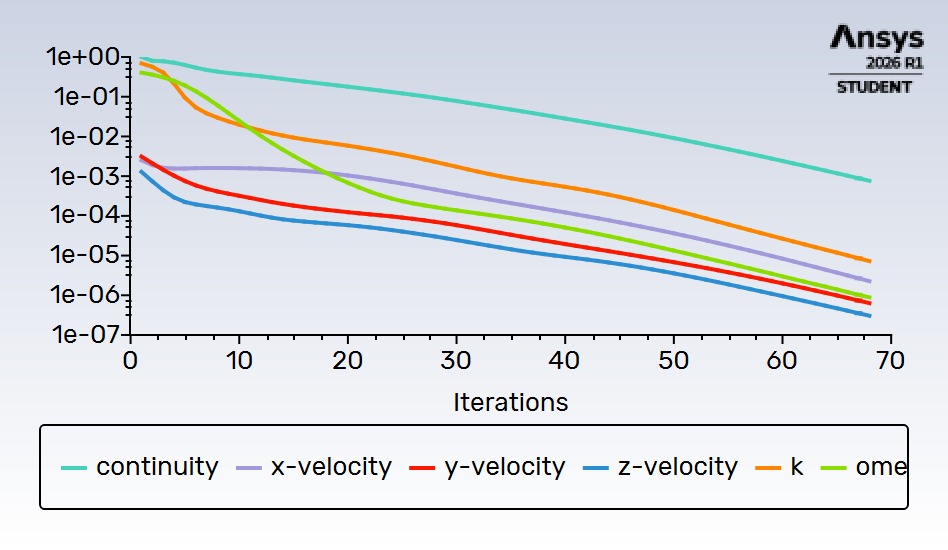
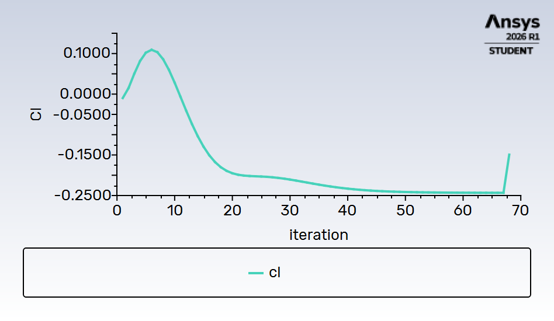

# Simulation CFD — Profil NACA 0012 | α = 15°

## Description

Dans le cadre de mon développement de compétences en ingénierie des fluides, j'ai réalisé une simulation CFD complète d'un profil aérodynamique NACA 0012 en utilisant ANSYS Fluent 2026 R1 Student.

---

## Outils utilisés

- **Fusion 360** : modélisation 3D du profil NACA 0012 (corde 200mm, envergure 300mm), exporté en fichier STEP
- **ANSYS DesignModeler** : création du domaine fluide (boîte [-1m;3m] × [-0.3m;0.3m] × [-0.5m;0.5m]), soustraction booléenne de l'aile, définition des Named Selections (inlet, outlet, symmetry, wall_naca)
- **ANSYS Fluent Meshing** : génération du maillage volumique polyédrique (56 000 cellules) avec couches limites (boundary layers, smooth-transition, 3 couches)
- **ANSYS Fluent** : configuration et résolution de l'écoulement incompressible stationnaire

---

## Paramètres de simulation

| Paramètre | Valeur |
|---|---|
| Modèle de turbulence | k-omega SST |
| Régime | Stationnaire (steady-state) |
| Fluide | Air (ρ = 1.225 kg/m³, μ = 1.789×10⁻⁵ kg/m·s) |
| Vitesse | 30 m/s |
| Nombre de Reynolds | ≈ 400 000 |
| Angle d'attaque | α = 15° (Ux = 28.98 m/s, Uy = -7.76 m/s) |
| Inlet | Velocity-inlet |
| Outlet | Pressure-outlet (0 Pa) |
| Aile | Wall no-slip |
| Faces latérales | Symmetry |

---

## Résultats

Distribution de pression statique sur le profil à α = 15°, convergence obtenue en moins de 70 itérations.

- Pression min (extrados) : **-511 Pa**
- Pression max (intrados) : **+733 Pa**

---

## Ce que j'ai appris

- Construire un domaine fluide externe autour d'une géométrie importée et réaliser une soustraction booléenne
- Utiliser le workflow Watertight Geometry de Fluent Meshing pour générer un maillage de qualité
- Comprendre l'importance des Named Selections pour l'assignation des conditions aux limites
- Configurer un solveur RANS avec le modèle k-omega SST, adapté aux écoulements sur profils aérodynamiques à nombre de Reynolds modéré
- Définir des Report Definitions (Cl, Cd) avec les bons vecteurs de force en fonction de l'angle d'attaque
- Visualiser et interpréter les contours de pression statique : dépression sur l'extrados (-511 Pa), surpression sur l'intrados (+733 Pa), gradient cohérent avec la génération de force aérodynamique
- Lire la convergence des résidus et évaluer la qualité d'une solution CFD

---

## Analyse critique des résultats

### Qualité du maillage

Le maillage de 56 000 cellules polyédriques est insuffisant pour capturer correctement la couche limite sur le profil. Un maillage de qualité pour un profil NACA nécessite typiquement 500 000 à 2 millions de cellules avec un raffinage important au bord d'attaque et de fuite. La skewness maximale de 0.94 (surface mesh) et l'orthogonal quality minimale de 0.15 (volume mesh) sont des indicateurs de qualité médiocre — les valeurs cibles sont respectivement <0.85 et >0.2.

### Valeurs de Cl/Cd

Le Cd obtenu (~0.12) est environ 5 à 6 fois supérieur à la valeur théorique pour un NACA 0012 à Re=400k et α=15° (~0.02). Le Cl converge vers une valeur négative (~-0.25) alors qu'on attend ~+1.5, ce qui suggère un problème d'orientation du Force Vector lié à la convention d'axes de la géométrie. Ces écarts s'expliquent par trois facteurs cumulés : maillage trop grossier, couches limites insuffisantes (3 couches seulement, y+ probablement mal résolu), et domaine fluide peut-être trop petit en Y (±0.3m = 1.5 cordes seulement, contre 10-20 cordes recommandées).

### Convergence

La convergence en moins de 70 itérations est rapide mais pas nécessairement un signe de qualité — elle peut indiquer que le maillage est trop grossier pour résoudre les gradients fins de l'écoulement. Le résidu de continuité (~1e-3) n'atteint pas le critère standard de 1e-4 à 1e-6.

### Ce qu'il faudrait améliorer

- Raffiner le maillage à 500k+ cellules avec y+ ≈ 1 sur l'aile pour k-omega SST
- Agrandir le domaine fluide à ±10 cordes en Y et Z
- Vérifier l'orientation de la géométrie pour corriger le signe du Cl
- Valider les résultats contre les données XFOIL ou les tables NACA expérimentales

### Ce qui est correct

Malgré ces limitations, la physique qualitative est bien capturée : le gradient de pression entre intrados et extrados est cohérent, la convergence est stable, et la méthodologie complète (géométrie → maillage → setup → résultats) est maîtrisée. Pour un premier projet CFD sur ANSYS Fluent, les objectifs pédagogiques sont atteints.

---

## Prochaines étapes

Simulation pour α = 0°, 5° et 10° pour obtenir la polaire complète Cl/Cd = f(α).

| α | Ux (m/s) | Uy (m/s) |
|---|---|---|
| 0° | 30.00 | 0.00 |
| 5° | 29.89 | -2.61 |
| 10° | 29.54 | -5.21 |
| 15° | 28.98 | -7.76 |
