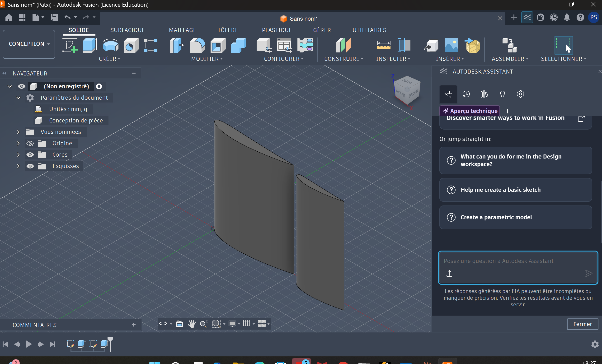
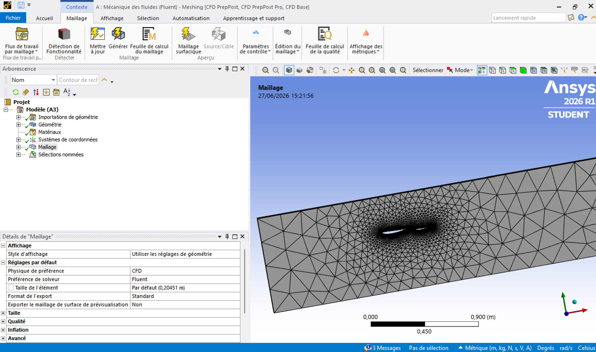
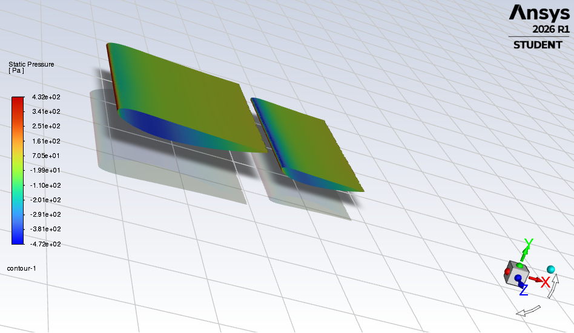
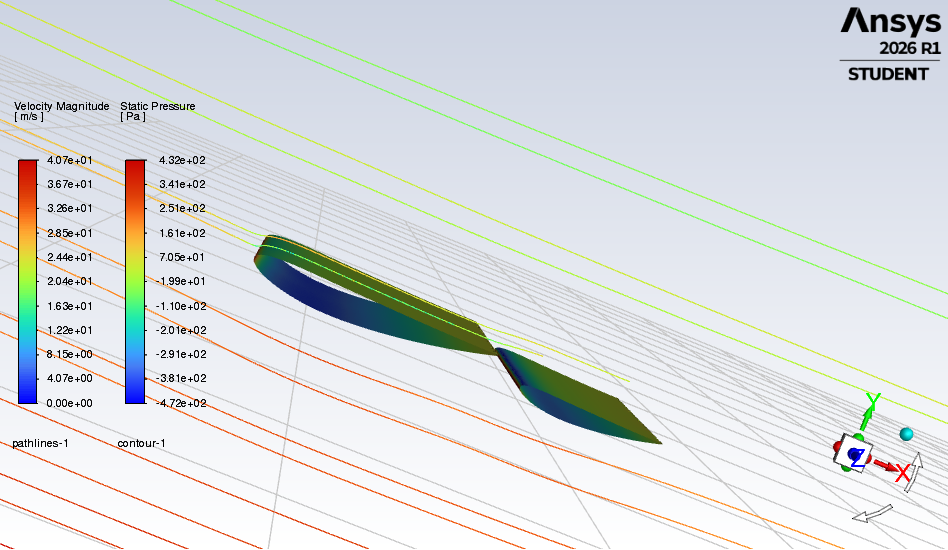
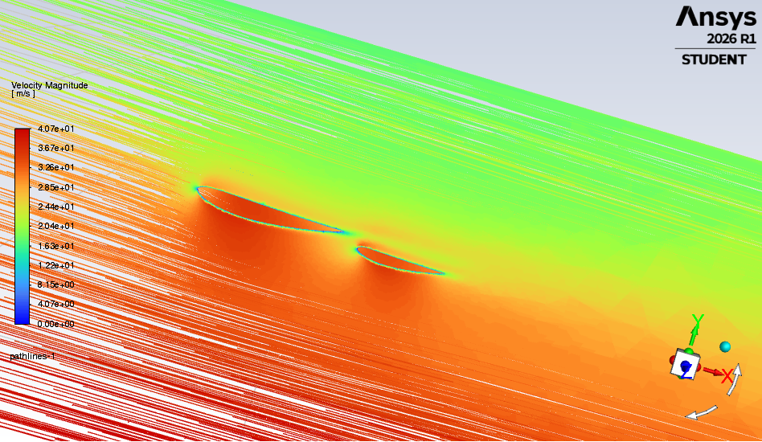
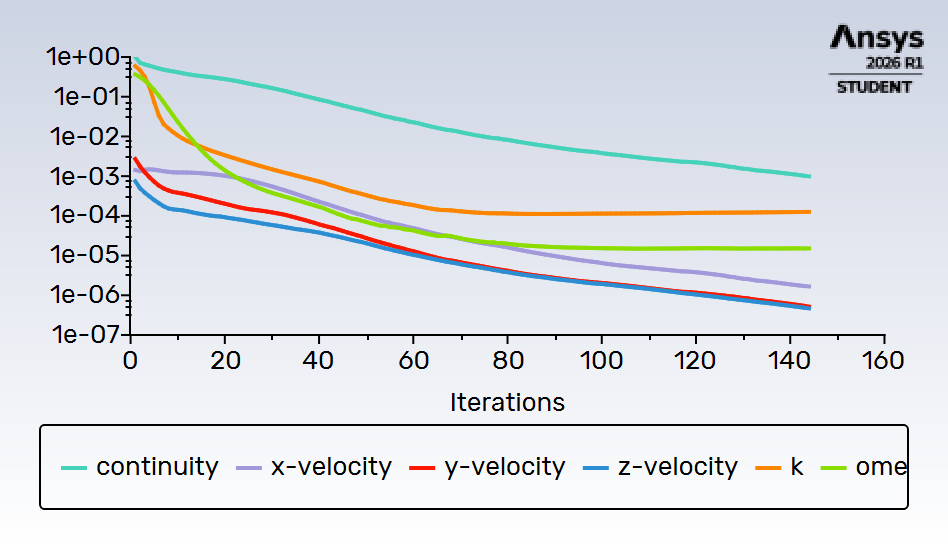
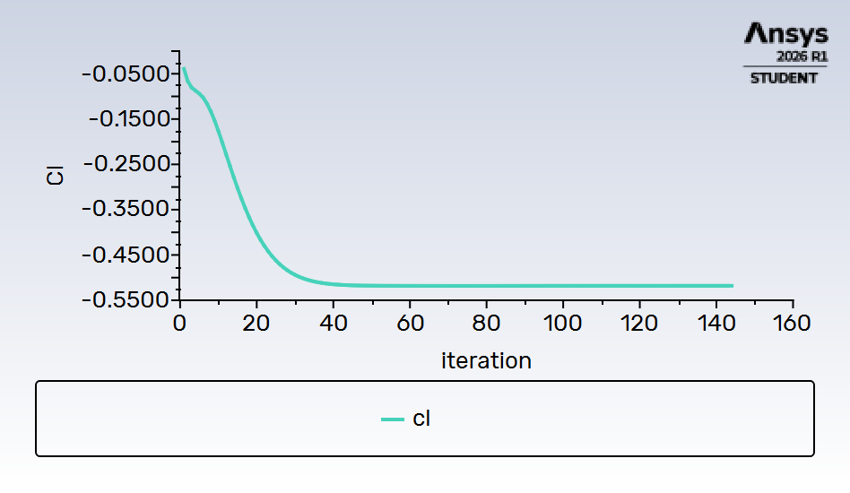
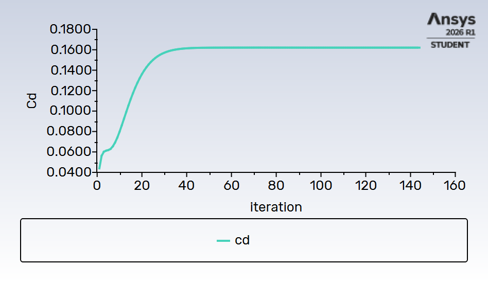

# 🏎️ Formula Student Front Wing — CFD Analysis

**NACA 4412 Inverted · Dual-Element · α = 15° · ANSYS Fluent 2026 R1**

> Full aerodynamic simulation of a two-element Formula Student front wing — from Python-generated geometry to Cl/Cd extraction.

---

## 📊 Key Results

| Coefficient | Value |
|---|---|
| **Cl** (downforce) | **−0.52** |
| **Cd** (drag) | **0.163** |
| **Cl/Cd ratio** | **3.19** |
| Convergence | ~145 iterations |
| Inlet velocity | 30 m/s · α = 15° |

The negative Cl confirms the inverted profile generates downforce — the primary objective of a Formula Student front wing.

---

## 🔧 Geometry

| Parameter | Value |
|---|---|
| Profile | NACA 4412 inverted |
| Main plane chord | 250 mm |
| Flap chord | 150 mm |
| Flap offset | X +280 mm / Y −20 mm |
| Span (half-model) | 300 mm |
| Angle of attack | 15° |

Geometry generated via custom Python script in Fusion 360 — 100-point cosine-spaced splines per profile for clean curvature at the leading edge. Exported as STEP and imported into ANSYS DesignModeler.



---

## 🕸️ Mesh

| Parameter | Value |
|---|---|
| Mesher | ANSYS Mechanical Meshing — CFD/Fluent preset |
| Domain | X[−1m, +3m] · Y[−0.5m, +0.3m] · Z[0m, +0.3m] |
| Element type | Tetrahedra |
| Wing surface sizing | **3 mm** (local refinement) |
| Global default size | ~205 mm |

The mesh features strong local refinement around both profiles — the concentric element density visible below captures boundary layer gradients and the inter-element slot flow.



---

## ⚙️ Solver Setup

| Parameter | Value |
|---|---|
| Solver | Pressure-Based · Steady |
| Turbulence model | **k-ω SST** |
| Inlet | Velocity Components — Vx = 28.98 m/s, Vy = −7.76 m/s |
| Outlet | Pressure-outlet · 0 Pa gauge |
| Symmetry | 4 domain faces |
| Walls | No-slip — `wall_mainplane`, `wall_flap` |
| Fluid | Air — ρ = 1.225 kg/m³ · μ = 1.7894×10⁻⁵ kg/(m·s) |
| Reference area | 0.075 m² (chord × span) |
| Reference chord | 0.25 m |
| Initialization | Hybrid |

The full ANSYS Workbench pipeline — geometry, mesh, setup, solution and results — completed successfully:


---

## 📈 Results

### Pressure Distribution

Static pressure contours on `wall_mainplane` and `wall_flap`. The differential between intrados (+432 Pa, red) and extrados (−472 Pa, blue) is the direct aerodynamic source of downforce — the inverted profile forces high pressure above and low pressure below, generating net downward force.



---

### Velocity Streamlines

Pathlines colored by velocity magnitude, released from inlet. Flow accelerates beneath the profiles (red, ~40 m/s) and decelerates above (green/white). The dual-element slot effect is clearly visible — the flap re-energizes the boundary layer and delays separation.





---

### Convergence

Both Cl and Cd plateau by iteration ~40 and remain stable. Residuals for x/y/z-velocity reach 1×10⁻⁶, k and ω well converged. Continuity stabilizes at ~1×10⁻³ — acceptable for this mesh resolution without inflation layers.



| Monitor | Converged value |
|---|---|
| Cl | −0.52 |
| Cd | 0.163 |




---

## 🔍 Analysis

A Cl/Cd ratio of **3.19** is consistent with a two-element NACA 4412 at moderate incidence. The inverted configuration effectively generates downforce, as confirmed by the negative Cl and the clear pressure differential across both surfaces.

**Limitations — what would be improved in a refined study:**

- **No inflation layers** → near-wall resolution is limited; y+ not optimized for k-ω SST (target y+ < 1 for accurate skin friction)
- **Single operating point** — a polar sweep at α = 0°, 5°, 10°, 15°, 20° would map the full performance envelope and identify stall onset
- **Flap angle fixed** — sweeping flap deflection (0°, 15°, 30°) would enable slot geometry optimization for maximum Cl/Cd
- **No ground effect** — critical for a real FS front wing operating at 50–100 mm ride height; proximity to ground significantly increases downforce

---

## 🛠️ Tools & Workflow

```
Python (Fusion 360 API)          ← NACA 4412 profile generation (100-pt cosine spacing)
    ↓ STEP export
ANSYS DesignModeler              ← Fluid domain · Boolean subtract · Named Selections
    ↓
ANSYS Mechanical Meshing         ← Tetra mesh · 3mm local sizing on wing surfaces
    ↓
ANSYS Fluent 2026 R1             ← k-ω SST · steady · Cl/Cd Report Definitions
    ↓
Post-processing                  ← Pressure contours · Velocity pathlines · Convergence plots
```

---

## 📁 Repository Structure

```
formula_student/
├── README.md
├── scripts/
│   └── FS_Wing_v2.py            ← Fusion 360 Python script — generates both profiles
└── 
    ├── 01_pressure_contour_3D.png
    ├── 02_streamlines_frontal.png
    ├── 04_streamlines_best.png
    ├── 05_residuals.png
    ├── 06_cl_convergence.png
    ├── 07_cd_convergence.png
    ├── 08_mesh_closeup.png
    ├── 09_geometry_fusion360.png
    └── 10_workbench_complete.png
```

---

*Patxi Sallaberry — Mechanical Engineering · INSA Toulouse*  
*Erasmus exchange @ Linköping University (LiU) · Fall 2026*  
*CFD & Aerodynamics Portfolio — [github.com/Patxi-Sallaberry/cfd-projects](https://github.com/Patxi-Sallaberry/cfd-projects)*
