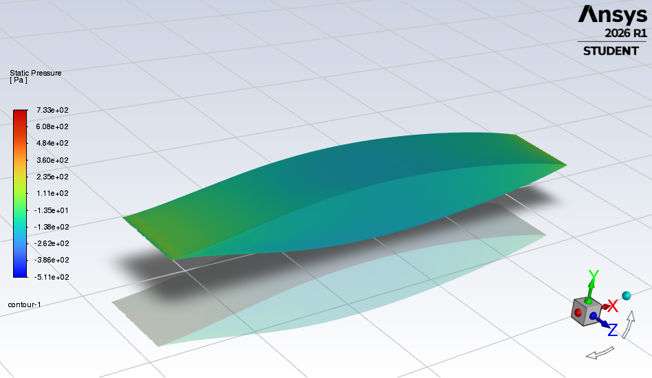
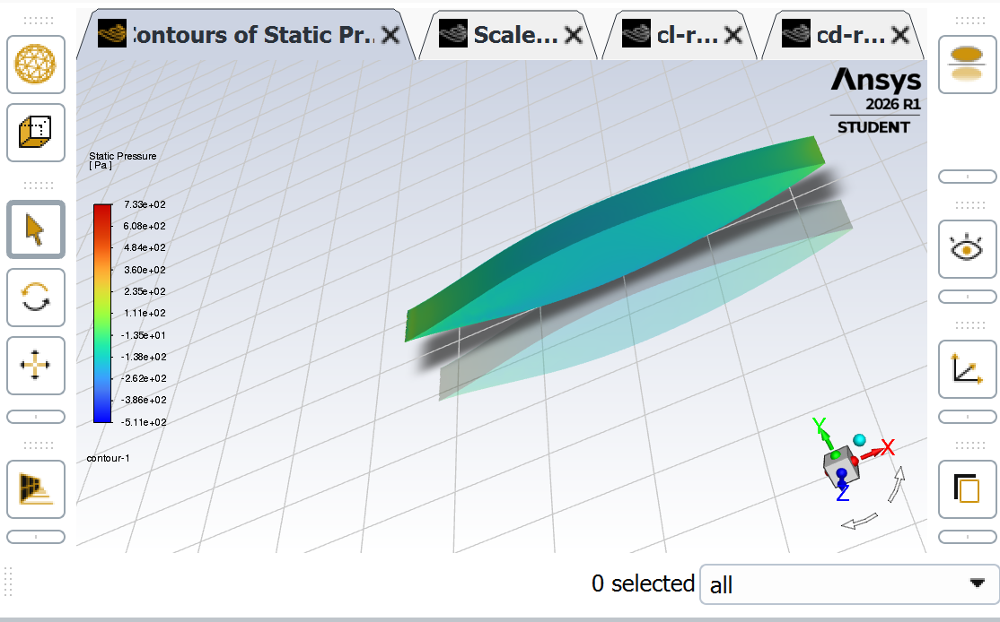
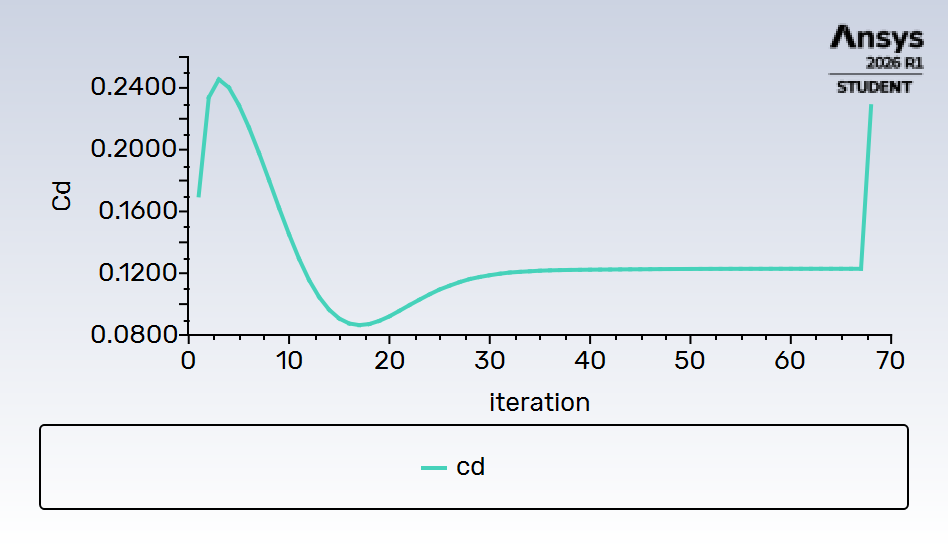
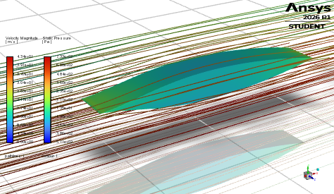

# CFD Simulation — NACA 0012 airfoil | α = 15°

## Description

As part of building my fluid-engineering skills, I ran a complete CFD simulation of a NACA 0012
airfoil using ANSYS Fluent 2026 R1 Student.

## Physical quantities

| Symbol | Meaning | Unit |
|---|---|---|
| α | angle of attack | degrees (°) |
| V (V∞) | free-stream velocity | m/s |
| Re | Reynolds number, `Re = ρ·V·c/μ` | dimensionless |
| ρ | air density | kg/m³ |
| μ | dynamic viscosity | kg/(m·s) = Pa·s |
| Cl, Cd | lift / drag coefficients | dimensionless |
| c | chord | m (200 mm) |

---

## Tools used

- **Fusion 360**: 3-D modelling of the NACA 0012 profile (chord 200 mm, span 300 mm), exported as STEP.
- **ANSYS DesignModeler**: fluid domain (box [−1 m; 3 m] × [−0.3 m; 0.3 m] × [−0.5 m; 0.5 m]), boolean
  subtraction of the wing, Named Selections (inlet, outlet, symmetry, wall_naca).
- **ANSYS Fluent Meshing**: polyhedral volume mesh (56,000 cells) with boundary layers
  (smooth-transition, 3 layers).
- **ANSYS Fluent**: setup and solution of the steady incompressible flow.

---

## Simulation parameters

| Parameter | Value |
|---|---|
| Turbulence model | k-ω SST |
| Regime | Steady-state |
| Fluid | Air (ρ = 1.225 kg/m³, μ = 1.789×10⁻⁵ kg/(m·s)) |
| Velocity | 30 m/s |
| Reynolds number | ≈ 400,000 |
| Angle of attack | α = 15° (Ux = 28.98 m/s, Uy = −7.76 m/s) |
| Inlet | Velocity-inlet |
| Outlet | Pressure-outlet (0 Pa) |
| Wing | No-slip wall |
| Side faces | Symmetry |

---

## Results

Static-pressure distribution on the airfoil at α = 15°; convergence reached in under 70 iterations.

- Min pressure (suction side): **−511 Pa**
- Max pressure (pressure side): **+733 Pa**

### Streamline visualization

Pathlines (coloured by velocity magnitude) overlaid on the static-pressure contour at α = 15°.

The flow clearly accelerates over the suction side (red, ~43 m/s) and slows down downstream of the
trailing edge. The streamlines follow the airfoil curvature with no visible separation, consistent
with a 15° angle of attack on a symmetric NACA 0012 at Re ≈ 400,000 — close to stall but not yet
separated at this mesh resolution.

---

## What I learned

- Building an external fluid domain around an imported geometry and performing a boolean subtraction.
- Using Fluent Meshing's Watertight Geometry workflow to generate a quality mesh.
- The importance of Named Selections for assigning boundary conditions.
- Configuring a RANS solver with the k-ω SST model, suited to airfoil flows at moderate Reynolds.
- Defining Report Definitions (Cl, Cd) with the correct force vectors as a function of the angle of attack.
- Reading and interpreting static-pressure contours: suction on the upper surface (−511 Pa),
  overpressure on the lower surface (+733 Pa), a gradient consistent with aerodynamic force generation.
- Reading residual convergence and assessing the quality of a CFD solution.

---

## Critical analysis of the results

### Mesh quality

The 56,000-cell polyhedral mesh is insufficient to capture the boundary layer correctly. A quality
mesh for a NACA airfoil typically needs 500,000 to 2 million cells with strong refinement at the
leading and trailing edges. The maximum skewness of 0.94 (surface mesh) and minimum orthogonal
quality of 0.15 (volume mesh) indicate poor quality — target values are < 0.85 and > 0.2 respectively.

### Cl/Cd values

The obtained Cd (~0.12) is about 5–6× higher than the theoretical value for a NACA 0012 at Re = 400k
and α = 15° (~0.02). Cl converges to a negative value (~−0.25) when ~+1.5 is expected, which points to
a Force Vector orientation issue tied to the geometry's axis convention. These deviations stem from
three cumulative factors: too coarse a mesh, insufficient boundary layers (only 3 layers, y⁺ probably
poorly resolved), and a fluid domain likely too small in Y (±0.3 m = only 1.5 chords, vs the
recommended 10–20 chords).

### Convergence

Convergence in under 70 iterations is fast but not necessarily a sign of quality — it may indicate the
mesh is too coarse to resolve the fine flow gradients. The continuity residual (~1e-3) does not reach
the standard criterion of 1e-4 to 1e-6.

### Streamlines

The streamlines qualitatively confirm the expected behaviour: no massive separation at α = 15°, clear
acceleration on the suction side, narrow wake downstream. This remains physically consistent, even if
the coarse mesh smooths the real gradients.

### What should be improved

- Refine the mesh to 500k+ cells with y⁺ ≈ 1 on the wing for k-ω SST.
- Enlarge the fluid domain to ±10 chords in Y and Z.
- Check the geometry orientation to fix the Cl sign.
- Validate the results against XFOIL or experimental NACA tables.

### What is correct

Despite these limitations, the qualitative physics is well captured: the pressure gradient between the
lower and upper surfaces is consistent, convergence is stable, and the full methodology (geometry →
mesh → setup → results) is mastered. The streamlines reinforce this conclusion, showing an attached,
well-structured flow around the airfoil. For a first CFD project on ANSYS Fluent, the learning
objectives are met.

> **Follow-up.** This run's polar was later revisited as the Phase 0 V&V case of the PIML project
> (`../piml/phase0_post_processor`), which diagnosed the Force-Vector and domain-blockage issues
> quantitatively against a reference polar.

---

## Next steps

Simulate α = 0°, 5° and 10° to obtain the full polar Cl/Cd = f(α).

| α | Ux (m/s) | Uy (m/s) |
|---|---|---|
| 0° | 30.00 | 0.00 |
| 5° | 29.89 | −2.61 |
| 10° | 29.54 | −5.21 |
