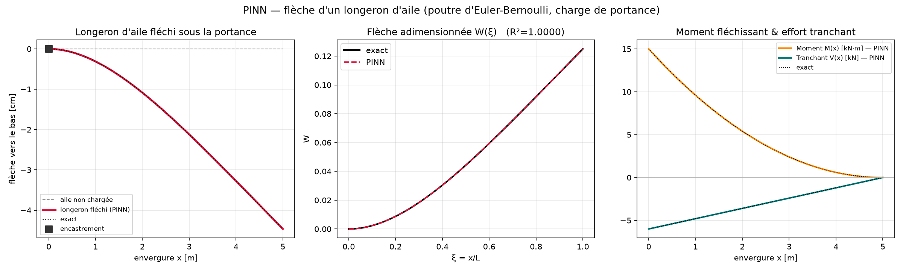

# Wing-spar deflection — an applied PINN (Euler–Bernoulli beam)

*A standalone showcase, outside the Phase-2/3 roadmap — a PINN in **structural mechanics** that
complements the airfoil aerodynamics work.*

## The concrete question
A wing's lift bends its **spar**. Clamped at the root (fuselage) and free at the tip, how much does a
5 m half-span aluminium spar **deflect** under the aerodynamic load — and what are the **bending moment**
and **shear force** it must survive? This is the structural half of aeroelasticity: aero load in →
structural response out.



One PINN gives the **whole structural response**: the deflected shape (left), the (non-dimensional)
deflection vs the exact solution — **R² = 1.0000** (middle), and the **bending moment & shear** derived
from the *same* network by autodiff (right). Physical results for the example spar: **tip deflection
≈ 4.5 cm** (0.89 % of the half-span) and **root bending moment ≈ 15 kN·m**.

Run: `python src/beam_pinn.py` (~1 min on CPU — deliberately lightweight).

## The physics
Euler–Bernoulli beam theory — a **4th-order** ODE:

$$EI\,\frac{d^4 w}{dx^4} = q(x), \qquad x\in[0,L]$$

with **cantilever** boundary conditions (clamped root, free tip):

| root `x = 0` (clamped) | tip `x = L` (free) |
|---|---|
| `w(0) = 0` (no deflection) | `w''(L) = 0` (no bending moment) |
| `w'(0) = 0` (no slope) | `w'''(L) = 0` (no shear force) |

`EI` is the flexural rigidity (`E` = Young's modulus, `I` = second moment of area) and `q(x)` the
distributed lift. From the solution: slope `w'`, **bending moment** `M = EI·w''`, **shear** `V = EI·w'''`.

## Why these design choices (the interesting part)

**① Non-dimensionalize first.** With `ξ = x/L` and `W = w / w_ref`, `w_ref = q0 L⁴/(EI)`, a **uniform**
load `q0` turns the equation into simply
```
W''''(ξ) = 1     on ξ ∈ [0, 1],   with the same 4 BCs
```
This is the #1 PINN best-practice (see [`../../references/pinn_playbook.md`](../../references/pinn_playbook.md)):
raw values `E ~ 7×10¹⁰`, `I ~ 3×10⁻⁵` would wreck training; here inputs are O(1) and the target W is
O(0.1). We recover physical numbers by scaling back at the end.

**② `tanh`, not ReLU.** We differentiate the output **four times**; ReLU's derivatives vanish. `tanh` is
smooth to all orders.

**③ 4th-order nested autograd** — the new bit vs Phase 2 (which stopped at 2nd order):
```python
W  = model(xi)
W1 = grad(W, xi); W2 = grad(W1, xi); W3 = grad(W2, xi); W4 = grad(W3, xi)   # W, W', W'', W''', W''''
```
`create_graph=True` at each step keeps the graph so the next derivative — and backprop of the loss
through all of them — works.

**④ Soft boundary conditions, weighted.** The loss is the ODE residual plus the four BCs as penalties:
```python
loss_phys = ((W4 - 1.0)**2).mean()                 # the ODE  W'''' = 1
loss_bc   = W0**2 + W0_1**2 + WL_2**2 + WL_3**2     # clamped root + free tip
loss      = loss_phys + 100 * loss_bc
```
At 4th order the BCs *are* the solution (they set the 4 integration constants), so they get a **higher
weight** (`W_BC = 100`) to make sure they're respected — a concrete case of the loss-weighting lesson.
*(Hard-constraining the clamped root via an ansatz `W = ξ²·NN(ξ)` is a valid alternative; soft BCs are
kept here for readability.)*

**⑤ Adam → L-BFGS.** Adam gets close, then an L-BFGS polish (2nd-order) drives the residual lower. Here
L-BFGS is *textbook-clean* because the collocation set is **fixed** → a **deterministic** loss.
> Contrast with the parametric airfoil PINN (Phase 2.6), where L-BFGS over a *re-sampled* batch
> over-fit and broke the solution. Same tool, opposite outcome — the difference is a deterministic batch.

**⑥ Uniform load for clean V&V.** A constant `q0` has an exact solution
`W(ξ) = ξ²(ξ²−4ξ+6)/24` (tip = 1/8), so we can *prove* correctness (R² = 1.0). The code is written so
`q(ξ)` can be swapped for a realistic **elliptical** lift distribution — you just lose the simple
analytic check.

## One network → four fields
Because the network *is* `W(ξ)`, autodiff hands us the entire structural response from a single model:
deflection `W`, slope `W'`, bending moment `∝ W''`, shear `∝ W'''` — all validated against the exact
curves in the figure. That "differentiate the surrogate to get derived quantities" property is a core
PINN advantage over a black-box regressor.

## Validation & physical results
| Quantity | PINN | Exact / expected |
|---|---|---|
| `R²` on `W(ξ)` | **1.0000** | 1 |
| tip deflection (non-dim) | **0.1250** | 1/8 = 0.1250 |
| tip deflection (dimensional) | **≈ 4.5 cm** | `q0 L⁴/(8EI)` |
| root bending moment | **≈ 15 kN·m** | `q0 L²/2` |

## 🔬 Experiment log — what changing the load teaches
A hands-on test run on CPU: **double the lift** (`Q0` from 1200 → 2400 N/m in `beam_pinn.py`) and re-run.

| quantity | `Q0 = 1200` | `Q0 = 2400` | ratio |
|---|---|---|---|
| tip deflection | 4.5 cm | **9.0 cm** | ×2 |
| root bending moment | 15 kN·m | **30 kN·m** | ×2 |
| non-dimensional `W(ξ)` shape, R² | identical, 1.0000 | **identical, 1.0000** | ×1 |

**Takeaway — linearity + why non-dimensionalization is powerful.** The beam equation `EI·w'''' = q` is
*linear* (like a spring `F = kx`): double the load → double the response. And because we solved the
**non-dimensional** problem `W''''(ξ) = 1` — which contains *no load and no stiffness* — the network
learns **one universal shape** `W(ξ)`; the physical deflection is just a **post-hoc rescaling**
`w = W · (q0 L⁴/EI)`. So doubling `Q0` doubles the physical numbers while the *trained network is
unchanged*. Non-dimensionalization cleanly separates **what the net learns (shape)** from **what is only
a scale factor (amplitude)** — verified here experimentally.

## ▶️ Run it yourself (CPU, ~1 min)
```bash
cd ~/projects/cfd-projects          # repo root
source .venv/bin/activate           # activate the Python environment  →  prompt shows (.venv)
python piml/applied_pinns/wing_spar_deflection/src/beam_pinn.py
```
The console prints the training loss, `R² = 1.00000`, the tip deflection and root moment. View the figure:
```bash
cd piml/applied_pinns/wing_spar_deflection/results && explorer.exe .   # (WSL → opens Windows Explorer)
```
To experiment, edit `Q0` (or `L_SPAN`, `I_SEC`) in `src/beam_pinn.py` and re-run. To restore the
reference: `git checkout -- src/beam_pinn.py results/beam_pinn.png`.

## Files
- `src/beam_pinn.py` — the model (heavily commented, French), validation, and figure.
- `results/beam_pinn.png` — the output figure.
- Uses the repo-root venv: `source ../../../.venv/bin/activate` then run.

*Related:* PINN foundations & methods in [`../../references/`](../../references); the Phase-2 PINN
progression in [`../../phase2_pinns/`](../../phase2_pinns).
