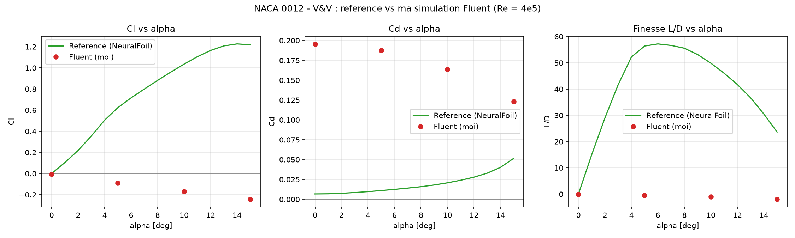

# Phase 0 — CFD Post-Processor (V&V)
*PIML Roadmap · July–August 2026*

A Python post-processor for **NACA 0012** aerodynamic coefficients, built on a
**Verification & Validation (V&V)** workflow: a documented, reproducible *reference*
polar is compared against my own **ANSYS Fluent** simulations, and the deviation is
quantified. This phase is the data foundation for the Phase 1 surrogate models.

> **Why V&V?** Training a surrogate (Phase 1) or a PINN (Phase 2) on noisy data teaches
> the model my errors. A clean, cited ground truth lets me separate *model* error from
> *data* error — and honestly report how my own CFD compares to it. As shown below, this
> workflow immediately **caught a setup bug** in my first Fluent run.

---

## V&V result — my first Fluent run is non-physical (and why that's useful)



| α | Cl (ref) | Cl (mine) | Cd (ref) | Cd (mine) | L/D (ref) | L/D (mine) |
|---|---|---|---|---|---|---|
| 0° | ≈ 0 | −0.007 | 0.007 | 0.196 | ≈ 0 | −0.03 |
| 5° | +0.623 | −0.088 | 0.011 | 0.188 | 56.4 | −0.47 |
| 10° | +1.035 | −0.169 | 0.021 | 0.163 | 49.9 | −1.04 |
| 15° | +1.219 | −0.244 | 0.052 | 0.123 | 23.6 | −1.98 |

My run is qualitatively wrong: a **symmetric** airfoil cannot have negative, growing-negative
lift, and drag cannot *decrease* with incidence. The V&V comparison makes the three root
causes explicit:

1. **Inverted Force Vectors.** My drag direction was set to `(cos α, +sin α)` while the inlet
   flow is `(cos α, −sin α)` (Uy < 0). Drag *must* point along the flow → the sign of `sin α`
   was flipped on both lift and drag, producing the negative Cl and the inverted Cd trend.
   Fix: `drag = (cos α, −sin α, 0)`, `lift = (sin α, cos α, 0)` — see
   [`docs/fluent_reports_NACA0012.md`](../../docs/fluent_reports_NACA0012.md).
2. **Domain blockage.** The fluid domain `y ∈ [−0.3, 0.3]` is only ±1.5 chords tall, so the
   airfoil chokes the channel: lift fails to develop and drag is inflated (Cd ≈ 0.2 vs ≈ 0.007).
   Even re-projecting the forces onto the correct axes leaves Cl negative — so the Force Vector
   is not the only issue.
3. **Coarse mesh.** 56k cells, no inflation layers, y⁺ unresolved, continuity residual ≈ 9·10⁻⁴
   (above the 10⁻⁴ standard). Drag is the most sensitive quantity to this.

**Conclusion:** this data is *not* usable for Phase 1 training, and is kept only as a documented
V&V diagnostic. The simulation will be re-run with corrected Force Vectors, a domain of ±10–20
chords, and an inflation-layer mesh (y⁺ ≈ 1). Raw run artifacts (convergence / residual plots,
original report) are archived under [`results/figures/fluent_runs/`](results/figures/fluent_runs).

---

## Reference data (ground truth)

Full provenance in [`data/SOURCES.md`](data/SOURCES.md):

| | |
|---|---|
| Tool | **NeuralFoil 0.3.2** (`xlarge`), via AeroSandbox — an **XFOIL surrogate** |
| Conditions | NACA 0012 · **Re = 4·10⁵** · Mach 0 · Ncrit 9 |
| Reproducible | `python src/generate_reference.py` regenerates `data/naca0012_reference.csv` |

> ⚠️ **Integrity note.** The reference is a numerical **prediction** (XFOIL-class), *not*
> experimental data and *not* my Fluent results. My runs are shown as overlaid points labelled
> *"Fluent (mine)"* — never presented as the reference.

## My CFD model (ANSYS Fluent)

Static-pressure field on my own NACA 0012 model (α = 15°) — *my simulation, coarse mesh*:


> Chord 200 mm · span 300 mm · k-ω SST · steady · Re ≈ 400 000. See
> [`naca0012-airfoil-CFD/`](../../naca0012-airfoil-CFD).

---

## How Cl / Cd are computed

Coefficients come from **forces**, not from the inlet velocity components:

```
Cl = L / (q∞ · S_ref)      Cd = D / (q∞ · S_ref)      q∞ = ½ · ρ · V∞²
```

with `ρ = 1.225`, `V∞ = 30 m/s`, `S_ref = chord × span = 0.06 m²`. In this run I read the Cl/Cd
coefficients directly from Fluent's *Report Definitions* (the force path above is kept as a
fallback in `postprocessor.py`).

## Stack

| Library | Version | Role |
|---|---|---|
| Python | 3.12 | Base runtime |
| NumPy | 2.5 | Array ops |
| Pandas | 3.0.3 | Data ingestion & structuring |
| Matplotlib | 3.11 | Polar / coefficient plots |
| NeuralFoil + AeroSandbox | 0.3.2 / 4.2.9 | Reference polar generation only |

## Directory structure

```
phase0_post_processor/
├── data/
│   ├── naca0012_reference.csv   # ground truth (generated, cited)
│   ├── naca0012_fluent.csv      # my Fluent run (flawed, kept for V&V)
│   └── SOURCES.md               # provenance & caveats
├── src/
│   ├── generate_reference.py    # regenerates the reference polar
│   └── postprocessor.py         # 3-panel V&V plot + error report
├── results/figures/
│   ├── naca0012_vv_polar.png    # reference vs Fluent (Cl, Cd, L/D)
│   └── fluent_runs/             # raw convergence/residual plots per α
└── requirements.txt
```

## How to run

```bash
cd cfd-projects/piml/phase0_post_processor

# (optional) regenerate the reference polar — needs: pip install neuralfoil aerosandbox
python src/generate_reference.py

# 3-panel V&V plot + console error table
python src/postprocessor.py
```

---

## Roadmap

| Phase | Period | Focus |
|---|---|---|
| **0** | Jul–Aug 2026 | Python stack + CFD post-processor, V&V *(here)* |
| 1 | Sep–Nov 2026 | PyTorch + surrogate model α → (Cl, Cd) — LiU |
| 2 | Dec 2026–Mar 2027 | PINNs via DeepXDE — cylinder → NACA 0012 |
| 3 | Apr 2027–Jun 2028 | Shape optimization + dashboard + write-up |

## Next step

Re-run the NACA 0012 sweep with corrected Force Vectors, a larger domain and an inflation-layer
mesh; fill `data/naca0012_fluent.csv` with the corrected Cl/Cd and re-run `postprocessor.py`.
Once the Fluent points land on the reference polar, the validated dataset feeds the Phase 1
surrogate (MLP / GPR mapping α → Cl, Cd) at LiU.
