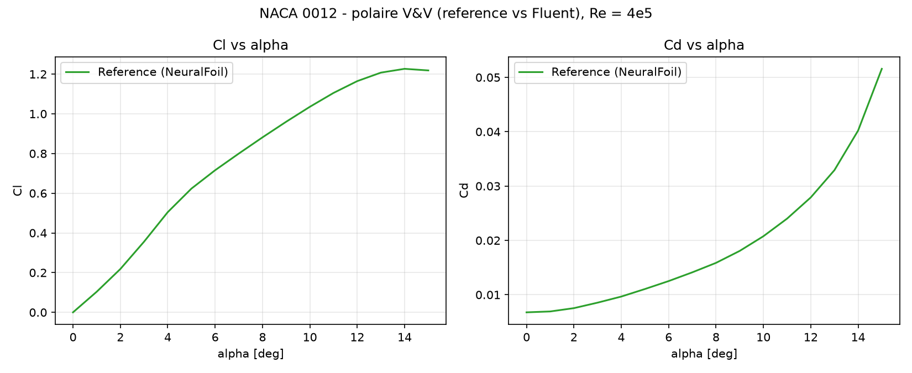

# Phase 0 — CFD Post-Processor (V&V)
*PIML Roadmap · July–August 2026*

A Python post-processor for **NACA 0012** aerodynamic coefficients, built on a
**Verification & Validation (V&V)** workflow: a documented, reproducible *reference*
polar is compared against my own **ANSYS Fluent** simulations, and the deviation is
quantified. This is the data foundation for the Phase 1 surrogate models.

> **Why V&V?** Training a surrogate (Phase 1) or a PINN (Phase 2) on noisy data teaches
> the model my errors. A clean, cited ground truth lets me separate *model* error from
> *data* error — and honestly report how my own coarse-mesh CFD compares to it.

---

## Methodology

The `data/` folder deliberately separates two things, and never mixes them:

| File | What it is | Provenance |
|---|---|---|
| `naca0012_reference.csv` | **Reference polar** (ground truth) | NeuralFoil (XFOIL surrogate), Re = 4·10⁵ — *generated, not measured* |
| `naca0012_fluent.csv` | **My own** Fluent runs (to fill) | ANSYS Fluent 2026 R1, k-ω SST, ~56k cells |

Full provenance, conditions and honesty caveats are documented in
[`data/SOURCES.md`](data/SOURCES.md).

> ⚠️ **Integrity note.** The reference is a numerical **prediction** (XFOIL-class), *not*
> experimental data and *not* my Fluent results. My simulations are shown as overlaid
> points labelled *"Fluent (mine)"* — never presented as the reference itself.

---

## Reference polar (Re = 4·10⁵)

Generated reproducibly with `src/generate_reference.py`:



Physically consistent: linear lift region, stall onset around α ≈ 13–14°, and a rising
drag bucket. My Fluent points will be overlaid here once exported.

## My CFD model (ANSYS Fluent)

Static-pressure field on my own NACA 0012 model (α = 15°) — *my simulation, coarse mesh*:


> Source of this image: my Fluent project, see [`naca0012-airfoil-CFD/`](../../naca0012-airfoil-CFD).
> Chord 200 mm · span 300 mm · k-ω SST · steady · Re ≈ 400 000.

---

## How Cl / Cd are computed

Coefficients come from **forces**, not from the inlet velocity components:

```
Cl = L / (q∞ · S_ref)      Cd = D / (q∞ · S_ref)      q∞ = ½ · ρ · V∞²
```

with `ρ = 1.225`, `V∞ = 30 m/s`, `S_ref = chord × span = 0.06 m²`. The forces `L` and `D`
are exported from Fluent (*Reports → Forces*) using the angle-dependent lift/drag
direction vectors — see [`docs/fluent_reports_NACA0012.md`](../../docs/fluent_reports_NACA0012.md).

| α (°) | Inlet Ux (m/s) | Inlet Uy (m/s) |
|------|----------|----------|
| 0    | 30.00    | 0.00     |
| 5    | 29.89    | −2.61    |
| 10   | 29.54    | −5.21    |
| 15   | 28.98    | −7.76    |

*(Ux/Uy = the tilted free-stream inlet condition, `Ux = 30·cosα`, `Uy = −30·sinα` — reference only.)*

---

## Stack

| Library | Version | Role |
|---|---|---|
| Python | 3.12 | Base runtime |
| NumPy | 2.5 | Array ops |
| Pandas | 3.0.3 | Data ingestion & structuring |
| Matplotlib | 3.11 | Polar / coefficient plots |
| NeuralFoil + AeroSandbox | 0.3.2 / 4.2.9 | Reference polar generation only |

*PyTorch added in Phase 1 · DeepXDE in Phase 2 · FastAPI + Next.js in Phase 3*

## Directory structure

```
phase0_post_processor/
├── data/
│   ├── naca0012_reference.csv   # ground truth (generated, cited)
│   ├── naca0012_fluent.csv      # my Fluent runs (to fill)
│   └── SOURCES.md               # provenance & caveats
├── src/
│   ├── generate_reference.py    # regenerates the reference polar
│   └── postprocessor.py         # reference + Fluent overlay + error report
├── assets/                      # published figures (committed)
├── outputs/                     # scratch figures (git-ignored)
└── requirements.txt
```

## How to run

```bash
cd cfd-projects/piml/phase0_post_processor

# (optional) regenerate the reference polar — needs: pip install neuralfoil aerosandbox
python src/generate_reference.py

# plot reference, overlay Fluent points (if filled), report deviation
python src/postprocessor.py
```

To add my results: fill `lift_N` / `drag_N` in `data/naca0012_fluent.csv` from the Fluent
Force Reports, then re-run `postprocessor.py` — the points appear on the polar with the
relative error vs the reference printed to console.

---

## Roadmap

| Phase | Period | Focus |
|---|---|---|
| **0** | Jul–Aug 2026 | Python stack + CFD post-processor, V&V *(here)* |
| 1 | Sep–Nov 2026 | PyTorch + surrogate model α → (Cl, Cd) — LiU |
| 2 | Dec 2026–Mar 2027 | PINNs via DeepXDE — cylinder → NACA 0012 |
| 3 | Apr 2027–Jun 2028 | Shape optimization + dashboard + write-up |

## Next step → Phase 1

At LiU (September 2026): train a first surrogate (MLP or GPR) mapping α → (Cl, Cd) on this
dataset, using the reference polar as ground truth and the Fluent runs as a validation case.
