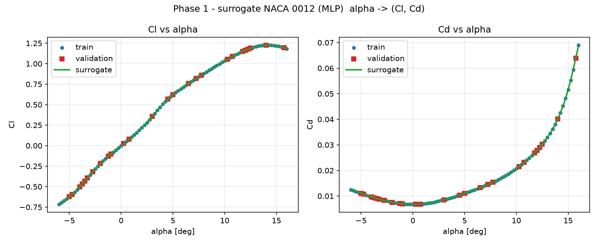
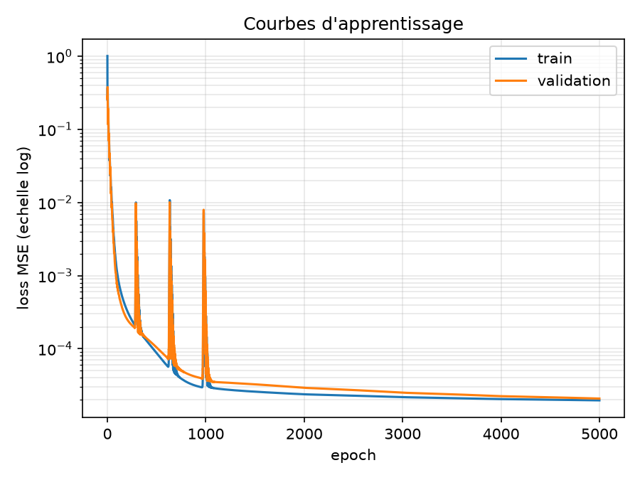
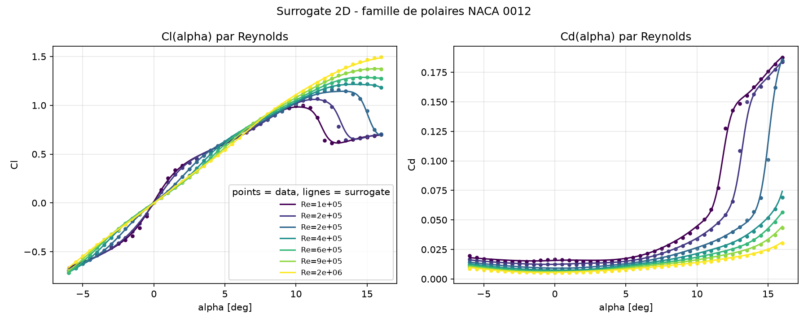
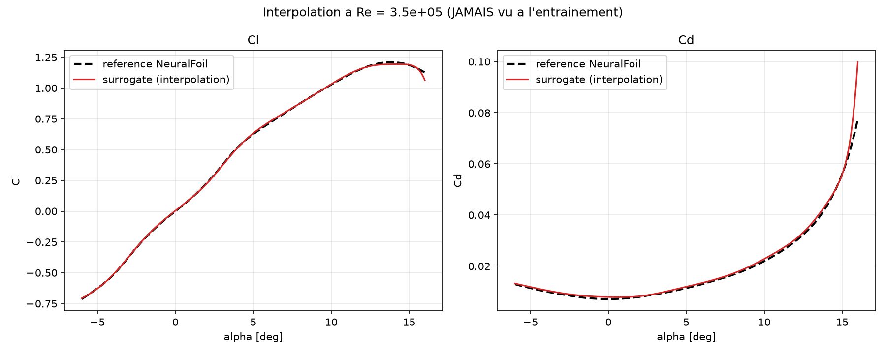

# Phase 1 — Surrogate Model (α → Cl, Cd)
*PIML Roadmap · Sep–Nov 2026 · LiU*

A first **surrogate model**: a small neural network (PyTorch MLP) that learns the NACA 0012
polar `α → (Cl, Cd)` from data and predicts it **instantly** — replacing an expensive CFD run
with a learned function. This README is also a **self-contained study sheet**: it explains every
concept and every line of `src/train_surrogate.py`.

> New to PyTorch itself? Read the companion guide [`docs/pytorch_guide.md`](../../docs/pytorch_guide.md)
> (zero → expert), then come back here for the applied walkthrough.

---

## Result



| Output | Validation RMSE | Validation R² |
|---|---|---|
| Cl | 0.0026 | 1.000 |
| Cd | 0.00007 | 1.000 |

The surrogate reproduces the polar on **held-out validation points** it never saw during training.

> **Why so perfect?** The data is a smooth, noiseless function (a NeuralFoil/XFOIL polar), so a
> tiny MLP fits it almost exactly. This is a *learning milestone*, not a hard ML problem — the real
> difficulty comes with **noisy/sparse** data and **higher-dimensional** inputs (see Next step).

> ⚠️ **Provenance.** Training data is an XFOIL-class prediction, *not* my own CFD (my Phase 0 Fluent
> run was non-physical — see `../phase0_post_processor`). A clean, cited ground truth is the right
> choice for learning the ML pipeline.

---

## Dynamique d'entraînement : validation & early stopping

La boucle (v2) suit **deux loss par epoch** — train et validation —, décroît le learning rate via
un **scheduler (StepLR)**, et conserve le **meilleur** modèle (early stopping). Concepts détaillés
dans [`docs/pytorch_guide.md`](../../docs/pytorch_guide.md) §11 (scheduler), §12 (boucle canonique)
et §14 (régularisation).



**Comment lire cette courbe :**
- **train (bleu) et validation (orange) se superposent** → **aucun surapprentissage**. En cas
  d'overfit, l'orange décrocherait *au-dessus* du bleu ; ici les données sont propres (sans bruit),
  donc le modèle généralise parfaitement (R² = 1.000 en validation).
- **Des pics au début, puis un lissage net** : tant que `lr = 1e-2`, Adam (full-batch) fait
  ponctuellement des pas qui **sur-corrigent** → des pics (présents dans les **deux** courbes
  ensemble → artefact d'optimisation, **pas** un overfit). Le **scheduler `StepLR`** divise le `lr`
  par 2 toutes les 1000 epochs : on voit les pics **disparaître après ~epoch 1000**, une fois le
  `lr` réduit. Gain mesuré : pic max divisé par **~21** vs `lr` constant (guide §11).
- **Pourquoi l'early stopping sert ici** : on **mémorise les meilleurs poids** (val_loss minimale
  ≈ 2·10⁻⁵) et on les **restaure** à la fin → le modèle livré n'est jamais celui d'un pic.

Pseudo-code de la boucle (le détail est dans le Bloc 5 plus bas) :
```python
best_val = inf
for epoch in range(EPOCHS):
    model.train();  opt.zero_grad()                    # 1) entrainement
    loss = mse(model(Xtr), Ytr);  loss.backward();  opt.step()
    sched.step()                                        #    decroit le learning rate
    model.eval()                                        # 2) validation (sans gradient)
    with torch.no_grad():  vloss = mse(model(Xva), Yva)
    if vloss < best_val:                                # 3) early stopping : garder le meilleur
        best_val, best_state, patience = vloss, copie(model.state_dict()), 0
    else:
        patience += 1
        if patience >= PATIENCE:  break                # val stagnante -> on arrete
model.load_state_dict(best_state)                       # restaure le MEILLEUR (pas le dernier)
```

---

# Comprendre le modèle (fiche de révision)

## 1. L'idée en une phrase

On apprend une **fonction** `f : α → (Cl, Cd)` à partir d'exemples, pour prédire les coefficients
aérodynamiques **instantanément**, sans relancer une simulation CFD (lente).

C'est de l'**apprentissage supervisé** (on a les bonnes réponses pour s'entraîner) en
**régression** (la sortie est un nombre continu, pas une catégorie).

```
Sans ML :   α  →  [CFD : des heures]        →  Cl, Cd
Surrogate : α  →  [réseau : millisecondes]  →  Cl, Cd
```

## 2. Où tourne le ML

| | Rôle |
|---|---|
| **GitHub** | Un **placard** : stocke le code et les résultats, garde l'historique, partage. **N'exécute rien.** |
| **Ta machine** | C'est là que le ML **tourne** : sur le **processeur (CPU)** de ton PC, via Python. |

Le cycle réel :
```
1. on écrit le code          (sur la machine)
2. on le LANCE : python ...  (ça calcule sur la machine : CPU, ou GPU si disponible)
3. ça produit résultats + figures
4. on push sur GitHub        (sauvegarde / partage)
```
Un laptop suffit ici. On irait sur **Google Colab** (GPU gratuit, navigateur) ou un cluster
seulement pour de **gros** modèles.

## 3. Le pipeline complet

```
   données (89 paires α→Cl,Cd)
        │
        ▼
   séparation train (70%) / validation (30%)
        │
        ▼
   normalisation (centrer-réduire, ajustée sur le train)
        │
        ▼
   modèle MLP  1→64→64→2   (~4400 paramètres à régler)
        │
        ▼
   boucle d'entraînement (jusqu'à 5000 epochs) :
        [train] forward → MSE → rétropropagation → Adam
        [val]   loss de validation (sans gradient)
        [early stopping] on garde les meilleurs poids
        │
        ▼
   évaluation finale : RMSE, R² (sur la validation)
        │
        ▼
   inférence : donner un α, obtenir (Cl, Cd) instantanément
```

## 4. Le code ligne par ligne

### Bloc 1 — Les données (entrée → sorties)
```python
X = df[["alpha_deg"]].values.astype("float32")   # entree  (N, 1)
Y = df[["Cl", "Cd"]].values.astype("float32")    # sorties (N, 2)
```
- `X` = la **feature** (entrée) : l'angle α. Forme `(N, 1)` = N exemples, 1 variable.
- `Y` = les **targets** (cibles) : Cl et Cd. Forme `(N, 2)`.
- `float32` = flottants 32 bits, le format standard des réseaux (rapide, assez précis).

### Bloc 2 — Séparation train / validation
```python
idx = rng.permutation(N)
n_val = int(0.3 * N)
val_idx, tr_idx = idx[:n_val], idx[n_val:]
```
- On mélange les indices et on réserve **30 %** des points pour la **validation**.
- **Pourquoi c'est essentiel** : si on notait le modèle sur ce qu'il a appris, il pourrait avoir
  appris **par cœur** sans généraliser (= **surapprentissage / overfitting**). La validation, *jamais
  vue pendant l'entraînement*, mesure la **vraie** capacité de prédiction — et sert d'aiguillage à
  l'**early stopping**.

### Bloc 3 — Normalisation
```python
xm, xs = Xtr.mean(0), Xtr.std(0)        # moyenne / ecart-type
ym, ys = Ytr.mean(0), Ytr.std(0)
norm_x = lambda a: (a - xm) / xs        # centrer-reduire
```
- On ramène chaque variable à **moyenne 0, écart-type 1** (standardisation).
- **Pourquoi** : α va de −6 à 16, Cd de 0.006 à 0.07 — des échelles très différentes. La descente
  de gradient converge **bien mieux** quand tout est à la même échelle.
- **Important** : moyenne/écart-type calculés sur le **train uniquement**. Sinon de l'information du
  test "fuiterait" dans l'entraînement (= **data leakage**) et la performance serait faussée.

### Bloc 4 — Le modèle (un MLP)
```python
model = nn.Sequential(
    nn.Linear(1, 64), nn.Tanh(),
    nn.Linear(64, 64), nn.Tanh(),
    nn.Linear(64, 2),
)
```
- `nn.Linear(1, 64)` = une **couche** de 64 **neurones**. Chaque neurone calcule `y = w·x + b`
  (somme pondérée + biais). Ici 1 entrée → 64 sorties.
- `nn.Tanh()` = **activation** non-linéaire. **Sans elle**, empiler des couches linéaires resterait
  linéaire → incapable d'apprendre une courbe. La non-linéarité permet de modéliser la polaire.
- Architecture `1 → 64 → 64 → 2` ; la dernière couche sort (Cl, Cd).
- **Paramètres** : `1·64+64` + `64·64+64` + `64·2+2` = 128 + 4160 + 130 ≈ **4 400** nombres à régler.
- **Théorème d'approximation universelle** : un MLP avec assez de neurones approxime n'importe quelle
  fonction continue → d'où sa capacité à apprendre la polaire.

### Bloc 4bis — Erreur et optimiseur
```python
loss_fn = nn.MSELoss()
opt = torch.optim.Adam(model.parameters(), lr=1e-2, weight_decay=1e-5)
sched = torch.optim.lr_scheduler.StepLR(opt, step_size=1000, gamma=0.5)
```
- `MSELoss` = **erreur quadratique moyenne** `moyenne((prédit − vrai)²)`, **le nombre à minimiser**.
- `Adam` = l'**optimiseur** qui modifie les poids. `lr=1e-2` = **learning rate** (taille du pas).
- `weight_decay=1e-5` = une **régularisation L2** légère (pénalise les gros poids). Faible ici car
  les données sont propres ; c'est surtout une bonne habitude.
- `StepLR` = un **scheduler** : il **multiplie le `lr` par 0.5 toutes les 1000 epochs**. `lr` élevé
  au début (convergence rapide) → `lr` faible à la fin (pas stables, sans pics).

### Bloc 5 — La boucle d'entraînement (train + validation + early stopping)
```python
best_val, best_state, since_best = inf, None, 0
for epoch in range(EPOCHS):
    # (a) entrainement
    model.train(); opt.zero_grad()
    loss = loss_fn(model(Xtr_t), Ytr_t); loss.backward(); opt.step()
    sched.step()                                  # decroit le learning rate
    # (b) validation (sans gradient)
    model.eval()
    with torch.no_grad():
        vloss = loss_fn(model(Xva_t), Yva_t).item()
    # (c) early stopping : on memorise le meilleur modele
    if vloss < best_val - 1e-7:
        best_val, since_best = vloss, 0
        best_state = {k: v.clone() for k, v in model.state_dict().items()}
    else:
        since_best += 1
        if since_best >= PATIENCE: break
model.load_state_dict(best_state)        # on restaure le MEILLEUR (pas le dernier)
```
À chaque epoch, **deux temps** :
1. **Entraînement** (`model.train()`) : les 5 étapes habituelles (zero_grad → forward → loss →
   backward → step).
2. **Validation** (`model.eval()` + `torch.no_grad()`) : on calcule juste la loss sur les points
   réservés, **sans** backward ni mise à jour.
3. **Early stopping** : si la `val_loss` bat son record, on **sauvegarde une copie** des poids
   (`best_state`). Si elle stagne pendant `PATIENCE` epochs, on **arrête**. À la fin, on **restaure
   le meilleur** modèle — pas le dernier (qui peut être sur un pic d'instabilité).

> `model.train()` / `model.eval()` changent le comportement de Dropout/BatchNorm (ici sans effet,
> mais c'est l'habitude canonique).

### Bloc 6 — Évaluation finale (sur la validation)
```python
model.eval()
with torch.no_grad():
    Pva = denorm_y(model(Xva_t).numpy())
rmse = np.sqrt(np.mean((pred - true) ** 2))
r2   = 1 - np.sum((pred - true) ** 2) / np.sum((true - true.mean()) ** 2)
```
- `torch.no_grad()` : pas de gradients en évaluation → plus rapide.
- `denorm_y` : retour aux vraies unités (Cl, Cd physiques).
- **RMSE** = erreur typique en unités physiques ; **R²** = qualité d'ajustement (**1 = parfait**,
  0 = pas mieux que la moyenne), calculé sur la **validation** → mesure la généralisation.

### Bloc 7 — Inférence + figure
```python
a_dense = np.linspace(X.min(), X.max(), 300)...
p_dense = denorm_y(model(torch.tensor(norm_x(a_dense))).numpy())
```
- On demande au modèle de **prédire** sur 300 angles fins = **inférence** : un α → (Cl, Cd)
  immédiatement. On sauvegarde la figure et les **poids** (`results/surrogate_naca0012.pt`).

## 5. Glossaire

| Terme | Définition courte |
|---|---|
| **Apprentissage supervisé** | Apprendre à partir d'exemples *étiquetés* (entrée + bonne réponse). |
| **Régression** | Prédire une valeur *continue* (vs classification = catégorie). |
| **Feature / target** | Variable d'entrée / valeur à prédire. |
| **Train / validation** | Données d'apprentissage / réservées pour mesurer la généralisation (et piloter l'early stopping). |
| **Overfitting** | Le modèle apprend "par cœur" le train mais généralise mal (écart train ≪ val). |
| **Early stopping** | Garder le modèle au minimum de la val_loss, pas celui de la dernière epoch. |
| **Courbes d'apprentissage** | train_loss et val_loss tracées par epoch ; leur écart révèle l'overfit. |
| **Normalisation** | Mettre les variables à la même échelle (moyenne 0, écart-type 1). |
| **Data leakage** | Fuite d'info du test vers l'entraînement → performance faussée. |
| **MLP** | Perceptron multicouche : un réseau de couches de neurones. |
| **Neurone** | Calcule `w·x + b` (somme pondérée + biais). |
| **Activation (tanh)** | Non-linéarité qui permet d'apprendre des courbes. |
| **Paramètres / poids** | Les nombres (`w`, `b`) que l'entraînement ajuste. |
| **Loss (MSE)** | Mesure d'erreur à minimiser : moyenne des écarts au carré. |
| **Epoch** | Un passage complet sur les données d'entraînement. |
| **Forward pass** | Calcul entrée → sortie du réseau. |
| **Rétropropagation** | Calcul des gradients de la loss par rapport aux poids. |
| **Gradient descent / Adam** | Algorithme qui met à jour les poids pour baisser la loss. |
| **Learning rate** | Taille du pas de mise à jour des poids. |
| **Scheduler** | Fait évoluer le learning rate au fil des epochs (ex. le diviser périodiquement) pour stabiliser la fin d'entraînement. |
| **Inférence** | Utiliser le modèle entraîné pour prédire sur de nouvelles entrées. |
| **RMSE / R²** | Métriques : erreur typique / qualité d'ajustement (1 = parfait). |

---

---

# Extension — Surrogate 2D : (α, Re) → (Cl, Cd)

Au lieu d'une seule courbe, le modèle apprend **toute une famille de polaires** (315 points :
45 angles × 7 Reynolds de 10⁵ à 1.5·10⁶) et sait **interpoler** à un Reynolds jamais vu.

**Nouveauté technique — `log(Re)`.** Le Reynolds varie d'un facteur ~15 → on le passe en
`log10(Re)` avant de normaliser, sinon son échelle écraserait l'information. C'est du *feature
engineering*. Entrée du réseau : `[alpha, log10(Re)]`, architecture `2 → 64 → 64 → 2`.

## La famille de polaires apprise



Points = données, lignes = surrogate. Le modèle capture toute la famille, **physique comprise** :
plus Re augmente, plus le **décrochage** est tardif et le **Cd** faible. Validation : R² = 0.999 (Cl),
0.994 (Cd).

## La preuve : interpolation à un Re jamais vu



À **Re = 3.5·10⁵** (absent de la grille d'entraînement), le surrogate (rouge) colle à la référence
NeuralFoil (pointillés) : **RMSE Cl = 0.008, Cd = 0.0023**. C'est *ça*, la puissance d'un surrogate —
un point de fonctionnement neuf prédit **instantanément**.

> ⚠️ **Honnêteté** : c'est de l'**interpolation** (entre des Re connus). En dehors de la plage
> 10⁵–1.5·10⁶, ce serait de l'**extrapolation**, bien moins fiable — un modèle ne sait pas inventer
> ce qu'il n'a jamais approché.

---

## Files

```
phase1_surrogate/
├── data/naca0012_surrogate_dataset.csv   # 1D : 89 pts, alpha -6..16, Re=4e5
├── data/naca0012_surrogate_2d.csv        # 2D : 315 pts (45 alpha x 7 Re)
├── src/make_dataset.py                    # 1D dataset
├── src/make_dataset_2d.py                 # 2D dataset (grille alpha x Re)
├── src/train_surrogate.py                 # 1D : train/val + early stopping + scheduler
├── src/train_surrogate_2d.py              # 2D : + log(Re) + demo interpolation
├── results/figures/learning_curves.png    # 1D : train vs val
├── results/figures/surrogate_fit.png      # 1D : data vs surrogate
├── results/figures/surrogate_2d_*.png     # 2D : courbes, famille, interpolation
├── results/surrogate_naca0012.pt          # 1D : poids
├── results/surrogate_2d_naca0012.pt       # 2D : poids
└── requirements.txt
```

## How to run

```bash
cd cfd-projects/piml/phase1_surrogate
pip install -r requirements.txt     # torch + neuralfoil + aerosandbox

python src/make_dataset.py          # 1D dataset
python src/train_surrogate.py       # 1D : train + evaluate + plot

python src/make_dataset_2d.py       # 2D dataset (alpha x Re)
python src/train_surrogate_2d.py    # 2D : train + interpolation demo
```

## Next step

- Add **Reynolds** as a second input → 2-D surrogate `(α, Re) → (Cl, Cd)`.
- Then **Phase 2**: physics-informed networks (PINNs) under PDE constraints.
