# Phase 2 — Physics-Informed Neural Networks (PINNs)
*In progress · Dec 2026 – Mar 2027 (LiU)*

**The idea.** Instead of learning from data (Phase 1), a PINN learns from the **physics itself**: the
governing equation is put **into the loss**. We differentiate the network's *output* w.r.t. its
*inputs* (via autograd) to build the equation's residual, and we minimize it. With (almost) no data,
the network discovers the solution.

| | Phase 1 (surrogate) | Phase 2 (PINN) |
|---|---|---|
| Learns from | data (input→output) | the equation (PDE/ODE residual) |
| Loss | data error | equation residual + boundary/initial conditions |
| Autograd differentiates | loss w.r.t. **weights** | also output w.r.t. **inputs** (to get u′, u″) |

## Physical quantities

| Symbol | Meaning | Unit |
|---|---|---|
| **t** | time | s |
| **x** | position (1-D space) | m |
| **u** | the field being solved (oscillator: displacement; heat: temperature) | m or K |
| **δ** | damping rate of the oscillator (energy dissipation) | 1/s |
| **ω₀** | natural angular frequency of the oscillator | rad/s |
| **α** | thermal diffusivity (how fast heat spreads), `α = k/(ρ·cₚ)` | m²/s |
| **ν** | kinematic viscosity (Burgers, upcoming) | m²/s |

> ⚠️ **Symbol clash:** in Phase 2, **α is the thermal diffusivity** (m²/s) — *not* the angle of
> attack of Phases 0–1. Same letter, different physics.

---

## 2.1 — First PINN: damped harmonic oscillator ✅

Solve, with **no data**, only the physics (a mass–spring–damper system):

$$u'' + 2\delta\,u' + \omega_0^2\,u = 0,\qquad u(0)=1,\ u'(0)=0\quad(\delta=2\ \mathrm{s^{-1}},\ \omega_0=20\ \mathrm{rad/s})$$

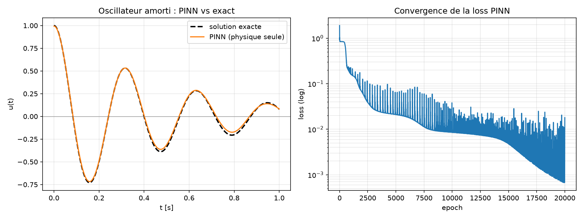

The PINN matches the exact solution with **R² = 0.998** — learned purely from the equation residual
plus the two initial conditions. The loss combines:
- `loss_phys = mean(residual²)` at 200 collocation points, where
  `residual = u'' + 2δ·u' + ω₀²·u` (u′, u″ obtained by `torch.autograd.grad` on the input `t`);
- `loss_ic` enforcing `u(0)=1`, `u'(0)=0`.

Run: `python src/pinn_oscillator.py`

> **Key new tool:** `torch.autograd.grad(u, t, create_graph=True)` — differentiating the output
> w.r.t. the input. `create_graph=True` lets us take the *second* derivative and still backprop the
> loss. Everything else (MLP, Adam, training loop) is the Phase 1 machinery.

### Understanding the code step by step

Only the parts that are **new** vs Phase 1 are detailed (the MLP, Adam and the loop are identical).

**① The network represents the solution** (not a data fit)
```python
model = nn.Sequential(nn.Linear(1,32), nn.Tanh(), ... , nn.Linear(32,1))
```
- `t → u`: the network **IS** the function `u(t)` we seek, not an interpolator of known points.
- **`tanh`, definitely not `relu`:** we take the **second derivative** `u''`. A ReLU's second
  derivative is zero everywhere → unable to represent curvature. `tanh` is smooth and infinitely
  differentiable.

**② Collocation points (≠ data)**
```python
t_phys = torch.linspace(0, 1, 200).reshape(-1,1).requires_grad_(True)
```
- 200 points where we **impose the equation** — we don't know `u` there, they are not data.
  `.requires_grad_(True)` because we will differentiate `u` w.r.t. `t`.

**③ The heart of the PINN: differentiate the output w.r.t. the input**
```python
u    = model(t_phys)
u_t  = torch.autograd.grad(u, t_phys, torch.ones_like(u),  create_graph=True)[0]
u_tt = torch.autograd.grad(u_t, t_phys, torch.ones_like(u_t), create_graph=True)[0]
```
- `torch.autograd.grad(u, t_phys, …)` computes `du/dt`. (In Phase 1, `loss.backward()` differentiated
  w.r.t. the **weights**; here we differentiate the **output w.r.t. the input** `t`.)
- **`torch.ones_like(u)`** (`grad_outputs`): since `u` is a vector (200 values), this seed of `1`
  asks, for each point, for `du_i/dt_i` (the network acts pointwise).
- **`create_graph=True`**: keeps the graph of the derivative itself → enables (a) the second
  derivative `u_tt` and (b) backpropagating the loss through these derivatives to train the weights.
- **`[0]`**: `autograd.grad` returns a tuple.

**④ The residual = the equation, put in the loss**
```python
residual  = u_tt + 2*DELTA*u_t + OMEGA0**2 * u     # = 0 if the ODE is satisfied
loss_phys = (residual ** 2).mean()
```
We write the equation literally. Correct solution ⇔ `residual = 0` everywhere → we minimize
`mean(residual²)`.

**⑤ Initial conditions (they select THE right solution)**
```python
u0   = model(t0)                                   # t0 = 0
u0_t = torch.autograd.grad(u0, t0, ...)[0]
loss_ic = (u0 - 1.0)**2 + (u0_t - 0.0)**2          # u(0)=1, u'(0)=0
```
The equation alone admits infinitely many solutions — **including the trivial `u ≡ 0`**, whose
residual is zero. Without ICs, the PINN collapses to that zero (tiny loss but wrong answer). The ICs
**anchor** the physical solution. *(Same idea in flow: these become the boundary conditions.)*

**⑥ Weighting `W_PHYS = 1e-4`**
```python
loss = W_PHYS * loss_phys + loss_ic.squeeze()
```
- `residual ≈ ω0²·u ≈ 400` → `residual² ≈ 1.6×10⁵`, whereas `loss_ic ≈ 1`. Without weighting, physics
  crushes the ICs.
- `W_PHYS=1e-4` brings `loss_phys` to ~O(1), comparable to `loss_ic` → both are respected. Balancing
  the loss terms is a core PINN tuning knob.

**Takeaway.** A low loss does not guarantee the right answer (cf. the trivial solution) → **always
validate** against a reference (here the analytic solution, R²=0.998).

---

## 2.2 — Heat equation `u_t = α u_xx` (a true PDE) ✅

First PDE: a diffusing field `u(x,t)` on x ∈ [0,1], with `u(x,0)=sin(πx)`, ends held at 0, and
thermal diffusivity **α = 0.4 m²/s**. Solved from physics + initial + boundary conditions, **with no
data**. **R² = 0.999** vs the exact solution `sin(πx)·e^{-απ²t}`.

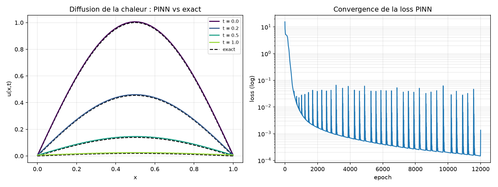

The sine bump decays in amplitude over time — that's diffusion. Run: `python src/pinn_heat.py`

**What's new vs the oscillator (2.1):**
- **2 inputs `(x, t)`** → the network learns a *field*, and we take **partial derivatives**: `u_t`
  (grad w.r.t. t) and `u_xx` (grad w.r.t. x, twice). `x` and `t` are kept as separate tensors so we
  can differentiate w.r.t. each.
- **Two kinds of constraint**: an **initial condition** (the t=0 profile) *and* **boundary
  conditions** (the two ends), each its own weighted loss term (`W_IC`, `W_BC`).

Otherwise the recipe is identical: minimize the residual `(u_t − α·u_xx)²` at collocation points.

### Understanding the code step by step

Only the **changes** vs the oscillator (2.1) are detailed — the shared concepts (autograd,
`grad_outputs`, `create_graph`, `tanh`, weighting) are explained in the 2.1 walkthrough.

**① A 2-input network**
```python
model = nn.Sequential(nn.Linear(2,32), nn.Tanh(), ... , nn.Linear(32,1))
# call: model(torch.cat([x, t], dim=1))
```
The first layer takes **2** inputs `(x, t)`. We assemble the columns with `torch.cat([x, t], dim=1)`
→ each row is a pair `(x, t)`. So the network learns a **field** `u(x,t)`.

**② Sampling: x and t kept separate**
```python
xc = torch.rand(N_COL,1, requires_grad=True)            # interior (PDE)
tc = (torch.rand(N_COL,1) * T).requires_grad_(True)
xi = torch.rand(N_IC,1);  ti = torch.zeros(N_IC,1);  ui = torch.sin(pi*xi)   # initial condition
tb = torch.rand(N_BC,1)*T; x0 = torch.zeros(N_BC,1); x1 = torch.ones(N_BC,1) # boundaries
```
- We keep `xc` and `tc` as **separate tensors** (both `requires_grad`) so we can differentiate w.r.t.
  **each** independently.
- Three families of points: **interior** (where we impose the PDE), **t=0** (initial condition, with
  target values `sin(πx)`), **boundaries x=0/x=1** (where `u` must be 0). The IC/BC points do *not*
  need `requires_grad`: they are **value** constraints, no differentiation there.

**③ Partial derivatives**
```python
u    = model(torch.cat([xc, tc], dim=1))
u_t  = torch.autograd.grad(u,   tc, torch.ones_like(u),   create_graph=True)[0]  # ∂u/∂t
u_x  = torch.autograd.grad(u,   xc, torch.ones_like(u),   create_graph=True)[0]  # ∂u/∂x
u_xx = torch.autograd.grad(u_x, xc, torch.ones_like(u_x), create_graph=True)[0]  # ∂²u/∂x²
```
`u` depends on `xc` **and** `tc` (via the `cat`). Differentiating w.r.t. `tc` gives `∂u/∂t`; w.r.t.
`xc`, `∂u/∂x`; re-differentiating `u_x` w.r.t. `xc` gives `∂²u/∂x²`. That's the whole difference vs the
oscillator: **partial** derivatives, one per direction.

**④ Three loss terms**
```python
loss_phys = ((u_t - ALPHA*u_xx)**2).mean()                       # the PDE
loss_ic   = ((model(cat([xi,ti])) - ui)**2).mean()               # u(x,0)=sin(pi x)
loss_bc   = (model(cat([x0,tb]))**2).mean() + (model(cat([x1,tb]))**2).mean()  # u(0,t)=u(1,t)=0
loss = loss_phys + W_IC*loss_ic + W_BC*loss_bc
```
The PDE (residual), the **initial** condition (value match at t=0) and the **boundary** conditions
(zero at the ends) — each its own term, weighted by `W_IC`/`W_BC`. Without IC+BC the solution would
not be unique (cf. the 2.1 lesson).

---

## 2.2b — Inverse problem: recovering an unknown parameter ✅ — *why PINNs matter*

The cases above just re-solve equations whose answer we already know — useful only to **learn and
validate** the method. A PINN earns its keep where a classical solver or an analytic formula **cannot
go**: **inverse problems**.

Here the thermal diffusivity **α (m²/s) is unknown**. We only have **40 noisy "sensor" measurements**
of `u`. The PINN learns the field `u(x,t)` *and* α at once, combining a **data** loss (fit the
measurements) with the **physics** loss (`u_t = α·u_xx`, with α a trainable parameter).

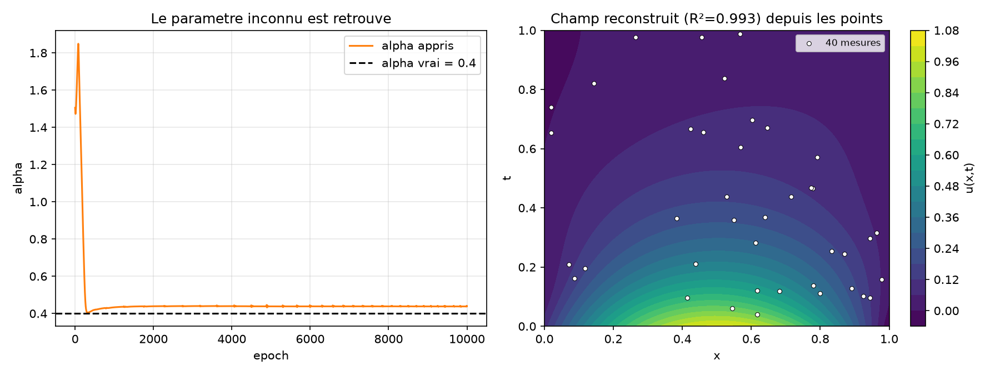

- **α recovered ≈ 0.44 m²/s** (true 0.4, ~10 % with noisy data) — starting from a deliberately wrong 1.5.
- The **full field is reconstructed (R² = 0.99)** from just 40 scattered points.

Run: `python src/pinn_heat_inverse.py`

### Understanding the code step by step

Only the **changes** vs the forward heat PINN (2.2) are detailed — the partial-derivative machinery
(`u_t`, `u_xx` via autograd) is identical and explained in the 2.2 walkthrough.

**① The measurements — the only "data" here** (sparse and noisy, like sensors)
```python
xm = np.random.rand(N_MEAS,1); tm = np.random.rand(N_MEAS,1)         # 40 random (x,t) locations
um = analytic(xm, tm) + 0.02*np.random.randn(N_MEAS,1)               # values + measurement noise
Xm, Tm, Um = (torch.tensor(a, dtype=torch.float32) for a in (xm,tm,um))
```
The forward problems (2.1, 2.2) used **no data**. The inverse problem **needs** a few measurements:
they are what makes the unknown parameter identifiable. The `0.02*randn` mimics real sensor noise.

**② The unknown parameter, made trainable**
```python
alpha = nn.Parameter(torch.tensor(1.5))      # deliberately wrong start; true value = 0.4
```
`nn.Parameter` turns a plain scalar into a **learnable variable**: it gets a gradient and is updated
just like a network weight. This is the crux of the inverse problem — α is no longer a fixed constant,
it is **discovered** during training.

**③ Optimize the network weights AND α together**
```python
opt = torch.optim.Adam(list(model.parameters()) + [alpha], lr=5e-3)
```
We hand the optimizer **both** the network's weights *and* α. At each step, gradient descent nudges
all of them to reduce the total loss → the field `u(x,t)` and the parameter α are learned jointly.

**④ Two loss terms: data + physics (with the current α)**
```python
loss_data = ((model(torch.cat([Xm,Tm],1)) - Um)**2).mean()           # fit the measurements
u   = model(torch.cat([xc,tc],1))
u_t = grad(u, tc, ...);  u_x = grad(u, xc, ...);  u_xx = grad(u_x, xc, ...)
loss_phys = ((u_t - alpha*u_xx)**2).mean()                           # heat eq with the LEARNED alpha
loss = loss_data + 1e-2*loss_phys
```
- `loss_data` pulls the field through the noisy measurements.
- `loss_phys` forces the field to obey `u_t = α·u_xx` — but with the **trainable** α. This is the
  coupling: the physics ties α to the shape of the field, the data ties the field to reality.
- **Why it works:** data alone → infinitely many fields through 40 noisy points; physics alone → α
  undetermined (and the trivial `u≡0`). **Together** they pin down the single α whose physical field
  matches the data.

**⑤ Watch α converge**
```python
a_hist.append(alpha.item())                  # record alpha every epoch -> the left plot
```
Plotting `a_hist` shows α climbing from 1.5, overshooting, then settling near the true 0.4 — the
visual proof the parameter was recovered.

**Why this is the whole point.** You *cannot* do this with the analytic formula — it requires already
knowing α. This is **data assimilation / parameter inference**: from sparse, noisy measurements +
physics, recover hidden quantities *and* the complete field. In a CFD context: infer an effective
viscosity or an unknown boundary condition, and reconstruct the flow field, from a few pressure taps
or scattered PIV points — something classical forward solvers don't naturally do.

> **Honest takeaway on Phase 2 so far:** 2.1 and 2.2 are *validation* exercises (known answers); 2.2b
> is the *real* use case. You always validate the machinery on a solved problem before trusting it on
> an unsolved one.

---

## 2.2c — Physics enables extrapolation beyond the data ✅ — *another reason PINNs matter*

A second, distinct proof of usefulness. We give noisy measurements of the damped oscillator **only on
the first third of the time** (t ∈ [0, 0.4]) and compare two models — *same architecture* — over the
full [0, 1]:

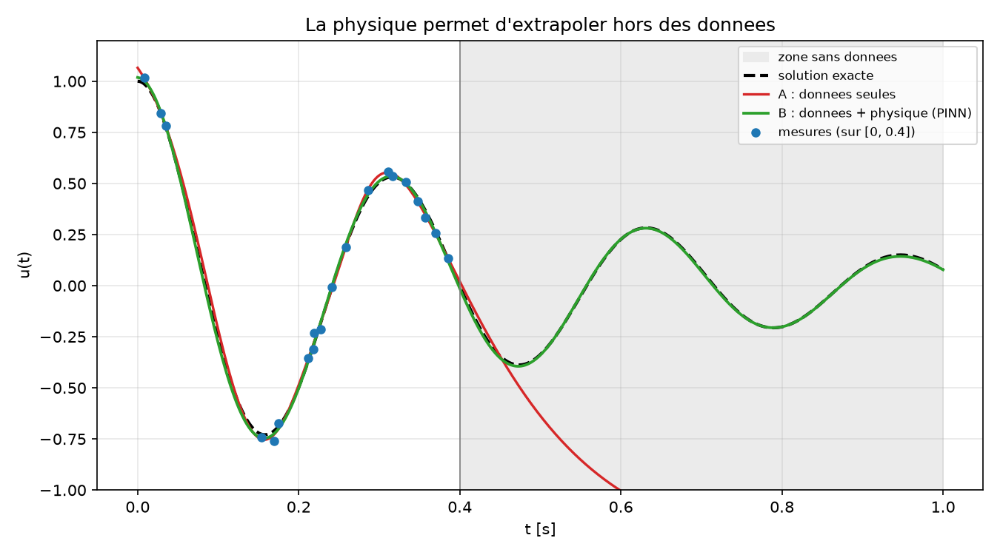

- **A — data only** (red): fits the measured region, then **diverges** in the no-data zone — it has no
  constraint there, so it has no reason to behave.
- **B — data + physics** (green, PINN): the ODE residual forces it to keep obeying the dynamics, so it
  **correctly continues the oscillation** where there is *no data at all*.

In the no-data zone [0.4, 1] the PINN is **~225× more accurate** (RMSE 0.005 vs 1.11).

**Why this matters.** Pure ML cannot extrapolate beyond its data — nothing constrains it there. The
physics acts as a **regularizer** that constrains the solution *everywhere*, even where measurements
are missing. In a CFD context: from sensors in one region you can extend a physically-consistent field
into regions you never measured.

Run: `python src/pinn_oscillator_extrapolation.py`

### What's new in the code
Two models, **same network**, trained differently:
```python
# A: data only
loss = ((mA(Td) - Ud)**2).mean()
# B: data + physics residual over the WHOLE domain (collocation points everywhere, incl. the no-data zone)
loss = ((mB(Td) - Ud)**2).mean() + 1e-4 * ((u_tt + 2*DELTA*u_t + OMEGA0**2*u)**2).mean()
```
The only addition in B is the physics term, evaluated on collocation points covering all of [0, 1] —
including the unmeasured part. That single term is what enables the extrapolation. (No explicit initial
condition is needed: the data near t=0 already anchors the solution.)

---

## 2.3 — Burgers' equation: a non-linear PDE that forms a shock ✅

### What this equation means, in plain words

$$\underbrace{u_t}_{\text{change in time}} \;+\; \underbrace{u\,u_x}_{\text{the wave transports itself}} \;=\; \underbrace{\nu\,u_{xx}}_{\text{viscous smoothing}}$$

`u(x,t)` is a 1-D wave (think of a velocity profile). Term by term:
- **`u_t`** — how `u` changes over time at a fixed point.
- **`u·u_x`** — *convection*: each point of the wave moves at a speed **equal to its own height `u`**.
  This is the **non-linear** term (u multiplies its own derivative); it is the 1-D cousin of the
  `u·∇u` term in Navier–Stokes.
- **`ν·u_xx`** — *diffusion*: viscosity (**ν**, m²/s) smooths sharp gradients.

Set-up: `x ∈ [−1, 1]`, `t ∈ [0, 1]`, initial profile `u(x,0) = −sin(πx)`, ends held at 0,
`ν = 0.01/π ≈ 0.0032`.

### Why a shock forms (the key intuition)

Because each point travels at its own speed `u`, the **fast parts catch up to the slow parts**:

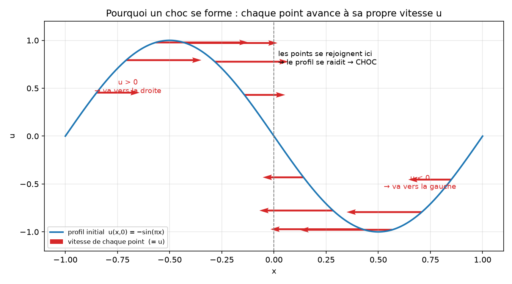

On the **left half** `u > 0` → those points move **right**; on the **right half** `u < 0` → they move
**left**. They **collide at x = 0**, piling up into an ever-steeper front. Viscosity stops it from
going truly vertical → a **shock** (a very thin, very steep transition).

### Watch it happen

Marching the equation forward in time (finite-difference reference), the smooth sine **steepens** into
a near-vertical front at x = 0:

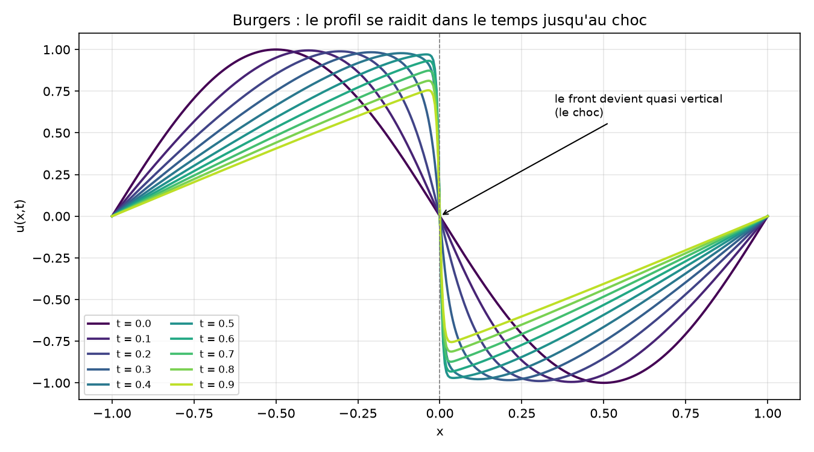

### The PINN result

The PINN learns this whole space–time field from the physics alone (residual + initial + boundary
conditions, **no data**), and matches the finite-difference reference at **R² = 0.999**:

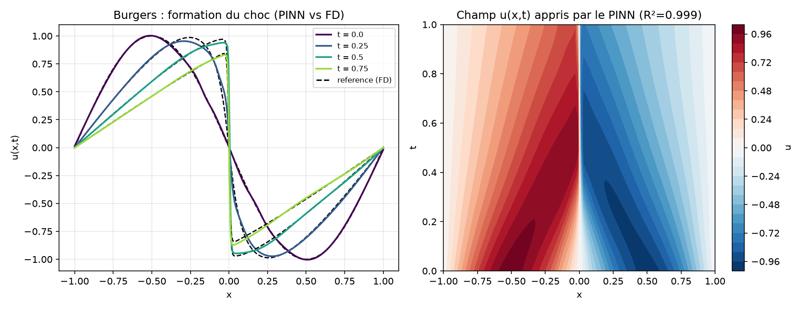

Left: profiles at several times (PINN solid vs FD dashed) — same steepening. Right: the learned field
`u(x,t)` (red = positive, blue = negative, sharp transition at x = 0). This is the historical PINN
benchmark (Raissi et al., 2019).
Run: `python src/pinn_burgers.py` · the two intuition figures: `python src/burgers_illustrate.py`

### Understanding the code step by step

**(a) The finite-difference reference** (`fd_reference`) — our "ground truth", since there is no
formula. It is the *classical* way to solve a PDE: discretize space into a grid and step forward in
tiny time steps.
```python
lap[1:-1]  = (un[2:] - 2*un[1:-1] + un[:-2]) / dx**2          # u_xx : central difference
dudx[1:-1] = np.where(un[1:-1] >= 0,
                      (un[1:-1] - un[:-2]) / dx,               # u_x : "upwind" — take the side the
                      (un[2:]   - un[1:-1]) / dx)              #   flow comes from (stable near shocks)
new = un + dt * (-un*dudx + NU*lap)                          # one step of u_t = -u*u_x + nu*u_xx
new[0] = new[-1] = 0                                          # boundary conditions
```
We march `nt` steps and keep the whole `U[t, x]` array — that is the reference field.

**(b) The PINN** — the same recipe as 2.2; the only real change is the residual:
```python
u    = model(torch.cat([xc, tc], 1))
u_t  = torch.autograd.grad(u,   tc, torch.ones_like(u),   create_graph=True)[0]
u_x  = torch.autograd.grad(u,   xc, torch.ones_like(u),   create_graph=True)[0]
u_xx = torch.autograd.grad(u_x, xc, torch.ones_like(u_x), create_graph=True)[0]
loss_phys = ((u_t + u*u_x - NU*u_xx) ** 2).mean()            # <- the new bit: u*u_x is non-linear
loss_ic   = ((model(cat([xi, ti])) - (-torch.sin(np.pi*xi))) ** 2).mean()   # u(x,0) = -sin(pi x)
loss_bc   = (model(cat([x_left, tb]))**2).mean() + (model(cat([x_right, tb]))**2).mean()  # ends = 0
loss = loss_phys + 20*loss_ic + 20*loss_bc
```
- The non-linearity is literally the product `u * u_x`: autograd gives `u_x`, we multiply by `u`. No
  special trick — the residual just reads like the equation.
- Because the front is sharp, we use a slightly **deeper** network (4 hidden layers) and a **StepLR**
  scheduler (halve `lr` every 4000 epochs) for stable late training.
- No analytic solution → we **validate against `fd_reference()`** (the V&V reflex).

> The convective term `u·u_x` is the bridge to real flows: the same `u·∇u` term sits inside
> Navier–Stokes. Master it here and the 2-D flow case (2.4) is the same idea with more terms.

---

## 2.4 — 2-D Navier–Stokes: solving a real flow ✅

The finale: the **full incompressible Navier–Stokes equations** in 2-D — **3 coupled equations** and
**3 outputs** `(u, v, p)` (x-velocity, y-velocity, pressure).

### The equations, in plain words
- **x-momentum** `u·u_x + v·u_y = −p_x + ν(u_xx + u_yy)` — how the flow accelerates in x: convection
  (the flow carrying itself) balanced by the pressure push and viscous friction.
- **y-momentum** — the same in y.
- **continuity** `u_x + v_y = 0` — **mass conservation** (what flows in flows out; incompressible).

`ν` is the kinematic viscosity (m²/s) = 1/Re. The convective terms `u·u_x`, `v·u_y` are the non-linear
heart — the 2-D version of the Burgers term from 2.3.

### The case: Kovasznay flow (Re = 40)
A steady 2-D flow that has an **exact analytic solution** of Navier–Stokes — the perfect V&V
benchmark. We impose the exact `(u, v, p)` on the domain boundary and minimize the 3 residuals inside.

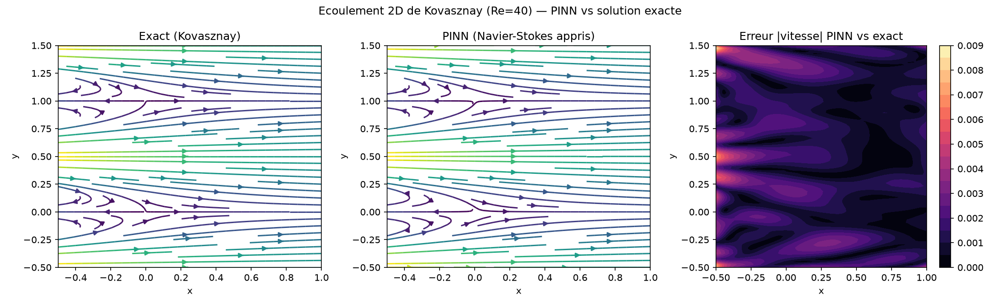

Left: exact streamlines. Middle: the PINN's learned flow (visually identical). Right: the tiny error.
Validation vs the exact solution: **R² = 1.000 (u), 0.9999 (v), 1.000 (p)**. The network learned a real
2-D velocity-and-pressure field from the physics alone. Run: `python src/pinn_navier_stokes.py`

### Understanding the code step by step

**One network, three outputs:**
```python
model = nn.Sequential(nn.Linear(2,40), nn.Tanh(), ..., nn.Linear(40, 3))   # (x,y) -> (u,v,p)
out = model(torch.cat([xc, yc], 1))
u, v, p = out[:, 0:1], out[:, 1:2], out[:, 2:3]                            # split the 3 outputs
```

**All the partial derivatives** (autograd; x and y kept as separate tensors):
```python
u_x, u_y = grad(u, xc), grad(u, yc)
v_x, v_y = grad(v, xc), grad(v, yc)
p_x, p_y = grad(p, xc), grad(p, yc)
u_xx, u_yy = grad(u_x, xc), grad(u_y, yc)
v_xx, v_yy = grad(v_x, xc), grad(v_y, yc)
```

**The three Navier–Stokes residuals** — the equations written literally:
```python
r_mx = u*u_x + v*u_y + p_x - NU*(u_xx + u_yy)     # x-momentum
r_my = u*v_x + v*v_y + p_y - NU*(v_xx + v_yy)     # y-momentum
r_c  = u_x + v_y                                  # continuity (mass)
loss_phys = (r_mx**2).mean() + (r_my**2).mean() + (r_c**2).mean()
loss_bc   = ((model(Bxy) - Buvp)**2).mean()       # exact (u,v,p) imposed on the boundary
loss = loss_phys + 10*loss_bc
```
The recipe is *exactly* the same as the previous PINNs — only bigger: 3 outputs, 3 equations, more
derivatives. Imposing `(u,v,p)` on the boundary also **fixes the pressure constant** (otherwise
pressure is only defined up to an additive constant).

> This is the very machinery you would point at flow around a NACA 0012: replace the box boundary by
> the airfoil surface (no-slip) plus a far-field, and the residual stays the Navier–Stokes equations.

---

## 2.5 — Flow around a real airfoil (NACA 4412)

Extending 2.4 from a simple box to an actual **NACA 4412** wing geometry (the Formula Student
profile), at α = 10°. This requires one key insight:

> **Boundary-layer theory.** A wing's flow has **two regions**: a razor-thin **viscous boundary
> layer** glued to the surface (thickness ∝ 1/√Re), and an **inviscid outer flow** everywhere else.
> At Formula-Student speed (**Re ≈ 10⁵–2·10⁵**) that boundary layer is *microscopic* — the streamlines
> you actually *see* are the **inviscid** outer flow. No PINN (and no mesh) can resolve such a thin
> layer at high Re, so we solve the **right model for each regime**.

### High-Re (Formula Student) — inviscid flow ✅

The credible model at racing speed. In velocity form (single-valued, robust) we solve:
`continuity u_x+v_y=0`, `irrotationality v_x−u_y=0`, **no-penetration** on the surface, free-stream far
away, and the **Kutta condition** (stagnation at the trailing edge) to set the circulation/lift. The
inviscid field is **Reynolds-independent** → valid at Re = 2·10⁵ and beyond.

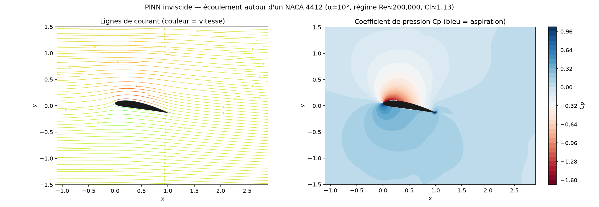

A credible lifting flow: a strong **suction peak (low Cp) on the suction side**, higher pressure below,
and lift coefficient **Cl ≈ 1.1** (computed by integrating the surface pressure — vs ~1.5 from
thin-airfoil theory; the PINN slightly under-predicts the circulation). Run:
`python src/pinn_flow_airfoil_inviscid.py` (~9 min).

> **Honesty.** This is the inviscid *outer* flow — it has **no boundary layer and no viscous drag**.
> For those (and the true turbulent Re), you need classical CFD (see
> [`../../front-wing-CFD`](../../front-wing-CFD)). Knowing *which model is valid where* is the point.

### Low-Re — viscous Navier–Stokes (illustrative) ✅

At a moderate, laminar **Re = 100** the full viscous NS PINN converges and shows what the inviscid
model omits — the **viscous wake** behind the wing. No-slip (`u=v=0`) is imposed on the surface.

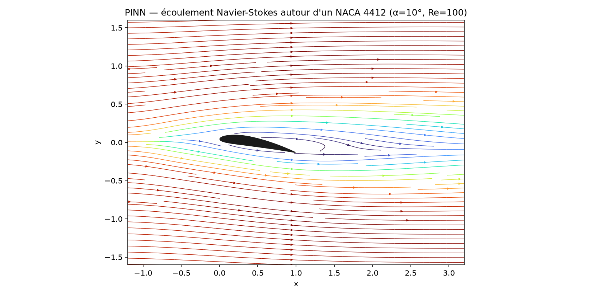

Run: `python src/pinn_flow_airfoil.py` (heavy — ~20 min). Momentum residual ~8·10⁻³ (approximate); this
is well below FS Reynolds — illustrative of the viscous mechanism only.

### "Flow for any angle?" → a parametric PINN
Each run above solves **one angle** (a PINN solves a single case per training). For an interactive
multi-angle visualization we train a **parametric** model `(x, y, α) → (u, v)` over a whole range of
angles at once — see **§2.6** below.

### What's new in the code (vs 2.4)
- **Real geometry:** the NACA 4412 contour is built analytically and rotated by the angle of attack;
  collocation points inside the airfoil are rejected (`matplotlib.path.Path.contains_points`).
- **Surface boundary:** no-slip (`u=v=0`, viscous) or no-penetration (`u·n=0`, inviscid) on the airfoil
  points, with outward normals computed from the contour.
- **Free-stream** on inlet/top/bottom, **open outlet** (leaving it free lets the lifting downwash pass
  → correct circulation), and the **Kutta** condition for the inviscid case.

---

## 2.6 — A *parametric* PINN: one network for every angle of attack

All previous PINNs solve **one case per training**. Here the goal is a single network
`(x, y, α) → (u, v)` trained over a **whole range of angles** `α ∈ [−5°, 15°]` at once, so the flow at
any angle is then a free forward pass — ideal for an interactive slider.

### The key design choice: keep the wing fixed, rotate the free-stream
If the wing rotated with α, the geometry, normals, collocation points and trailing edge would all move
with α — expensive to regenerate. Instead we keep the **wing fixed** (at α = 0) and **rotate the
incoming flow**: physically equivalent for inviscid flow (just a change of frame). The geometry is then
built **once**; only the boundary conditions carry α:

| | single-angle PINN (§2.5) | parametric PINN |
|---|---|---|
| geometry | wing rotated by α | **wing fixed** (α = 0) |
| far-field | `(u,v) → (1, 0)` | `(u,v) → (cos α, sin α)` ← α enters here |
| Kutta | `(u,v)=0` at the rotated TE | `(u,v)=0` at the fixed TE `(1, 0)` |
| network input | `(x, y)` | `(x, y, α)` (α normalized to [−1, 1]) |

### Attempt 1 — velocity formulation `(x,y,α)→(u,v)` ❌ (under-lifts)
Reusing the §2.5 velocity form with α as a third input. It **converges** (every loss term small) but
produces **~4× too little lift** — the streamlines barely deflect:

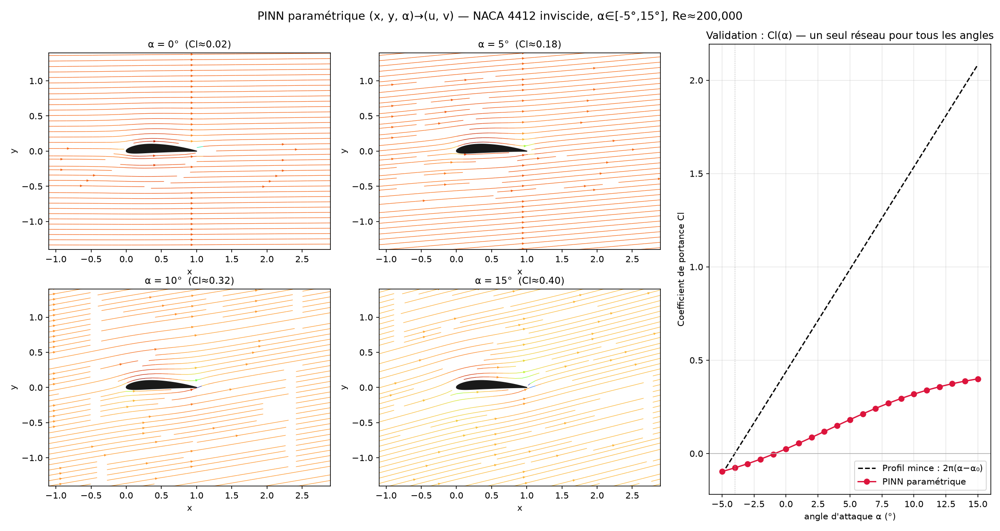

The reason is physical: **lift comes from circulation Γ, a *global* quantity** (a contour integral
around the wing), not a local one. A single Kutta point shared across all angles is a weak signal, and
the velocity form only *permits* circulation, it does not *force* it. The network settles on the easy,
near-zero-circulation optimum. Run: `python src/pinn_flow_airfoil_parametric.py`

### Attempt 2 — stream-function formulation `(x,y,α)→ψ` ✅ (right physics)
The network predicts a single scalar **ψ** (the stream function) and velocity derives from it:
`u = ψ_y`, `v = −ψ_x`. This **builds in mass conservation** (`u_x+v_y=0` is exact) and lets us pin the
body firmly as a streamline:

| constraint | velocity form | **ψ form** |
|---|---|---|
| continuity `u_x+v_y=0` | a loss term (competes) | **exact** by construction |
| wing surface | `u·n=0` (weak) | **ψ = 0 on the whole surface** (very firm) |
| irrotational | `v_x−u_y=0` | `∇²ψ = 0` (Laplace) |

The firm `ψ=0` body streamline lets the Kutta condition finally **bite** and select a real circulation.
Crucially, the far-field imposes the **velocity** `(ψ_y, −ψ_x) → (cos α, sin α)`, *not* the value of ψ
(clamping ψ would re-suppress circulation, since a vortex adds a `ln r` term).

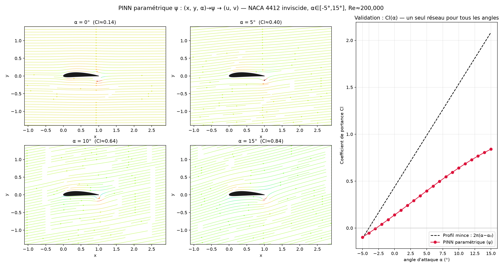

The streamlines now deflect with a clear **downwash** behind the wing, and a single network reproduces
the **whole lift curve**: linear `Cl(α)`, with a zero-lift angle near −3° (cambered 4412, expected
≈ −4°). Run: `python src/pinn_flow_airfoil_parametric_psi.py` (heavy — ~50 min, CPU).

| α | Cl — velocity form | **Cl — ψ form** | Cl — thin-airfoil theory |
|---|---|---|---|
| 0° | 0.02 | **0.14** | 0.44 |
| 10° | 0.32 | **0.64** | 1.54 |
| 15° | 0.40 | **0.84** | 2.08 |

### Honest takeaway — a documented limitation
The ψ form **doubles** the lift and captures the **correct physics** (linear curve, right zero-lift
angle, realistic flow), but still under-predicts the *magnitude* by ~2×. The remaining gap is the
**Laplace residual** (`∇²ψ ≈ 2.6×10⁻²`, not negligible): a small distributed spurious vorticity acts
like an opposite circulation and "leaks" some of the bound circulation, while Kutta stays satisfied
locally. The **parametric** network spreads its capacity across 21 angles, so its per-angle residual is
higher than a single-angle PINN's — hence more leakage. Pushing the residual down (denser collocation,
higher Laplace weight, an L-BFGS polish) would close the gap further; getting to the exact theoretical
circulation is a known accuracy limit of velocity/ψ-form potential PINNs.

> **Why this section is worth keeping.** It's the real engineering loop: a first formulation that
> *converges yet is wrong*, a diagnosis rooted in the physics (circulation is global), a principled fix
> (stream function), and an honest accounting of what remains. Validating against theory is what made
> the failure visible in the first place.

---

## Phase 2 — done ✅

ODE → linear PDE → inverse problem → extrapolation → non-linear PDE (shock) → **2-D Navier–Stokes** →
**viscous flow around a real airfoil** → **parametric flow PINN** (one network for every angle). The
full PINN toolbox is built and validated.

**Possible extensions:** push the parametric PINN's accuracy (denser collocation / L-BFGS polish to
close the circulation gap), or **couple Phases 1 & 2** — e.g. use sparse CFD/experimental points + the
NS residual to reconstruct a full flow field and infer parameters.

Foundations: see the PyTorch guide [`../../docs/pytorch_guide.md`](../../docs/pytorch_guide.md)
(§5 autograd, §20 PINNs).
